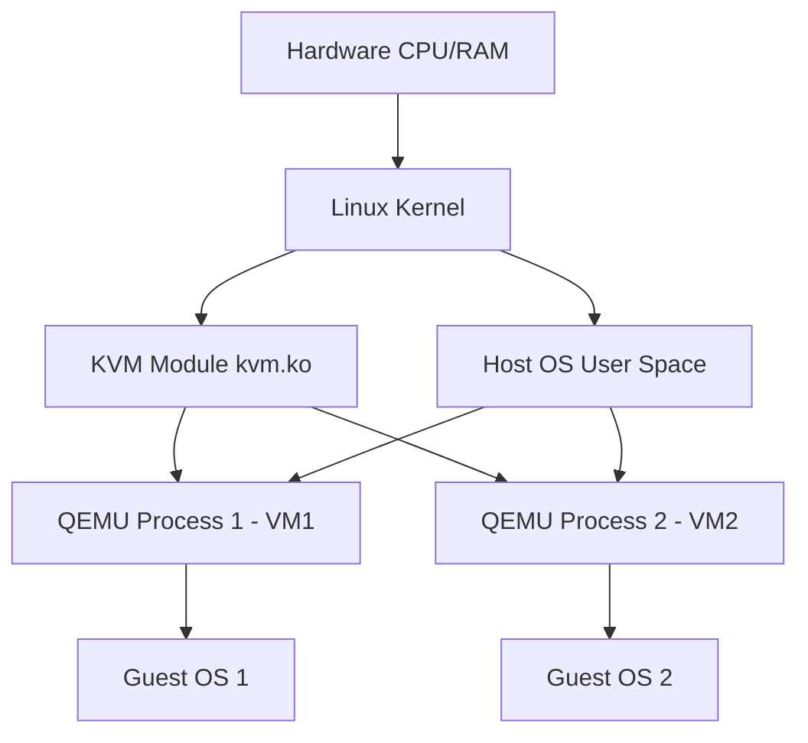

# KVM и QEMU

## DevOps-история
**Боль:** Сервера простаивали, нагрузка была неравномерной. Запускать каждый сервис на отдельном железе было дорого, а выделение новых ресурсов разработчикам занимало дни.
**Решение:** Переход на KVM (Kernel-based Virtual Machine) позволил превратить Linux-ядро в мощный гипервизор (Type 1/2 гибрид), а QEMU обеспечил эмуляцию аппаратного обеспечения для гостевых ОС, позволив утилизировать железо на 100% и автоматизировать деплой ВМ.

## Архитектура


## Примеры (Bash / virsh)
Создание и запуск виртуалки через `virt-install` (libvirt):
```bash
virt-install \
  --name web-server-01 \
  --ram 2048 \
  --vcpus 2 \
  --disk path=/var/lib/libvirt/images/web-server-01.qcow2,size=20 \
  --os-variant ubuntu22.04 \
  --network network=default \
  --graphics none \
  --console pty,target_type=serial \
  --location 'http://archive.ubuntu.com/ubuntu/dists/jammy/main/installer-amd64/' \
  --extra-args 'console=ttyS0,115200n8 serial'
```

## Day 2 operations
- **Мониторинг:** Используйте `virt-top` и экспортеры Prometheus (например, `libvirt-exporter`) для отслеживания утилизации CPU/RAM виртуалками.
- **Бэкапы:** Делайте снапшоты (qcow2) через `virsh snapshot-create-as`, но для консистентных бэкапов используйте заморозку ФС через QEMU Guest Agent.
- **Тюнинг:** Включайте `hugepages` и `CPU pinning` (привязка vCPU к физическим ядрам) для требовательных к latency приложений, таких как базы данных.

## Антипаттерны
- Управление виртуалками "руками" через QEMU CLI в проде вместо использования `libvirt` (virsh, virt-manager) или платформ вроде Proxmox/OpenStack.
- Хранение дисков виртуалок в сырых img-файлах на медленных ФС без использования LVM, ZFS или Ceph.
- Игнорирование установки `qemu-guest-agent` в гостевых ОС (ведет к потере метрик, невозможности мягкого выключения и консистентных снапшотов).
