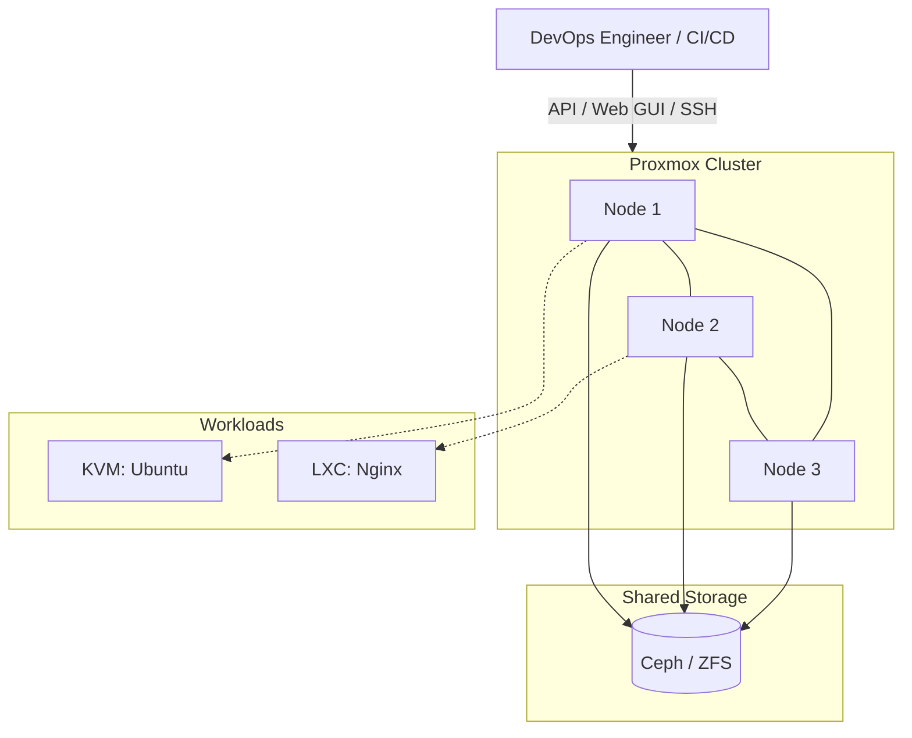

# Proxmox VE (Virtual Environment)

## DevOps-история (Боль и Решение)
**Боль:** Необходимость развертывания множества тестовых и продакшн-сред на собственном железе без покупки дорогих Enterprise-лицензий (например, VMware vSphere). Ручное создание виртуальных машин и контейнеров занимает уйму времени и приводит к эффекту "снежинки" (snowflake servers).
**Решение:** Proxmox VE — open-source платформа виртуализации, объединяющая KVM (виртуальные машины) и LXC (контейнеры). Позволяет управлять вычислительными ресурсами, сетью и хранилищем через единый веб-интерфейс или API. А в связке с Terraform и Ansible позволяет полностью автоматизировать жизненный цикл инфраструктуры (Infrastructure as Code).

## Архитектура



## Примеры (Terraform / Bash)

**Пример Bash: Установка qemu-guest-agent (на гостевой ОС Ubuntu/Debian)**
```bash
sudo apt update
sudo apt install qemu-guest-agent -y
sudo systemctl enable --now qemu-guest-agent
```

**Пример Terraform: Создание ВМ в Proxmox (используя провайдер bpg/proxmox или telmate/proxmox)**
```hcl
terraform {
  required_providers {
    proxmox = {
      source  = "telmate/proxmox"
      version = "2.9.14"
    }
  }
}

provider "proxmox" {
  pm_api_url      = "https://proxmox.example.com:8006/api2/json"
  pm_user         = "terraform-prov@pve"
  pm_password     = "your_password"
  pm_tls_insecure = true
}

resource "proxmox_vm_qemu" "web_server" {
  name        = "web-01"
  target_node = "pve1"
  clone       = "ubuntu-2204-template"
  
  cores   = 2
  sockets = 1
  memory  = 2048

  network {
    model  = "virtio"
    bridge = "vmbr0"
  }

  disk {
    type    = "scsi"
    storage = "local-lvm"
    size    = "20G"
  }
  
  os_type = "cloud-init"
  ipconfig0 = "ip=10.0.0.50/24,gw=10.0.0.1"
}
```

## Day 2 Operations (Советы)
- **Бэкапы (Proxmox Backup Server):** Обязательно используйте PBS. Он поддерживает дедупликацию, инкрементальные бэкапы и работает невероятно быстро.
- **Обновления:** Всегда читайте release notes перед обновлением нод (особенно мажорных версий) и обновляйте ноды по одной, предварительно мигрировав ВМ (Live Migration) на другие узлы кластера.
- **Мониторинг:** Настройте отправку метрик из Proxmox в InfluxDB/Prometheus (поддерживается из коробки) для визуализации в Grafana.
- **Quorum:** В кластере Proxmox (corosync) должно быть нечетное количество нод (минимум 3) для предотвращения split-brain. Если нод 2, используйте QDevice (например, Raspberry Pi).

## Антипаттерны
- ❌ **Создание ВМ вручную:** Кликать мышкой в веб-интерфейсе для создания десятков серверов. Используйте Packer для создания шаблонов и Terraform для развертывания.
- ❌ **Отсутствие qemu-guest-agent:** Забывать ставить гостевой агент. Без него Proxmox не знает реального IP-адреса ВМ и не может корректно выполнить freeze ФС перед бэкапом.
- ❌ **Хранение важных данных только на локальном LVM:** Без общего хранилища (Ceph, NFS, iSCSI, ZFS replication) невозможна живая миграция (Live Migration) и HA (High Availability).
