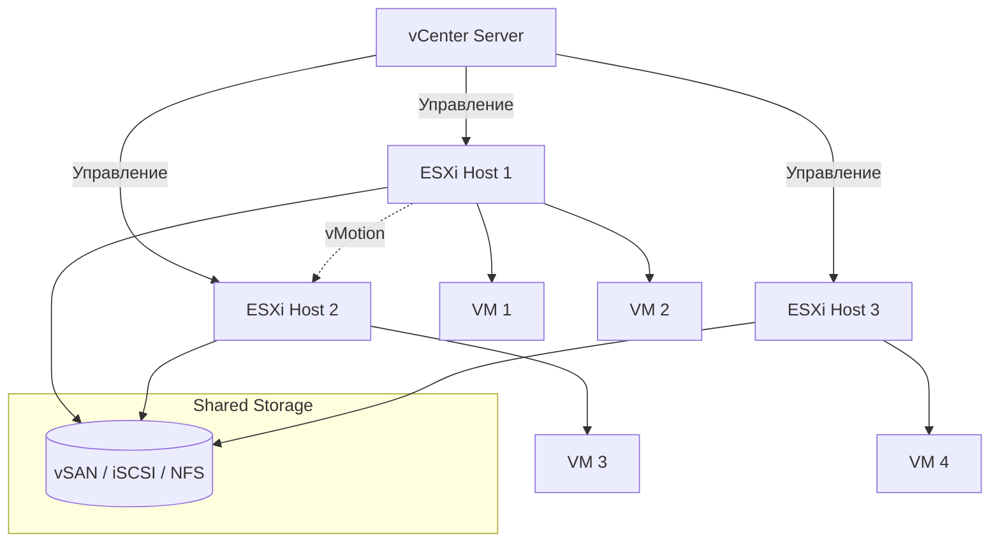

# VMware vSphere и ESXi

## DevOps-история
**Боль:** Сотни разрозненных серверов, зоопарк ОС, долгое выделение ресурсов разработчикам, длительные простои при падении железа (отсутствие отказоустойчивости).
**Решение:** Внедрение ESXi (гипервизор 1-го типа) для строгой абстракции железа и vCenter (vSphere) для централизованного управления кластерами. Это принесло High Availability (HA), vMotion (живая миграция ВМ без прерывания работы) и DRS (автоматическая балансировка нагрузки).

## Архитектура


## Примеры (Terraform)
Провижининг ВМ через IaC (провайдер `vsphere`):
```hcl
resource "vsphere_virtual_machine" "vm" {
  name             = "prod-db-01"
  resource_pool_id = data.vsphere_compute_cluster.cluster.resource_pool_id
  datastore_id     = data.vsphere_datastore.datastore.id

  num_cpus = 4
  memory   = 8192
  guest_id = "ubuntu64Guest"

  network_interface {
    network_id = data.vsphere_network.network.id
  }

  disk {
    label = "disk0"
    size  = 100
  }

  clone {
    template_uuid = data.vsphere_virtual_machine.template.id
    customize {
      linux_options {
        host_name = "prod-db-01"
        domain    = "local"
      }
      network_interface {
        ipv4_address = "10.0.0.50"
        ipv4_netmask = 24
      }
      ipv4_gateway = "10.0.0.1"
    }
  }
}
```

## Day 2 operations
- **Обновления:** Используйте vSphere Lifecycle Manager (vLCM) для консистентного обновления хостов кластера без даунтайма ВМ (ВМ автоматически мигрируют через DRS и vMotion).
- **Автоматизация (IaC & API):** Полностью автоматизируйте деплой через Terraform (как в примере) или Ansible (коллекция `community.vmware`).
- **Интеграция с Kubernetes:** Используйте CPI/CSI драйверы (или Tanzu) для интеграции K8s кластеров напрямую с хранилищами и сетями vSphere (динамический провижининг PV).

## Антипаттерны
- Создание "золотых" шаблонов (templates) вручную (ClickOps) вместо сборки их как кода через Packer.
- Избыточный overcommit по CPU (соотношение vCPU к физическим ядрам больше 4:1 для высоконагруженных систем), что приводит к высокому `CPU Ready Time` и "тормозам" ВМ.
- "Снапшоты как бэкапы": хранение старых снапшотов неделями/месяцами. Это замедляет работу дисковой подсистемы и чревато потерей данных (и долгим зависанием ВМ) при их удалении или консолидации.
