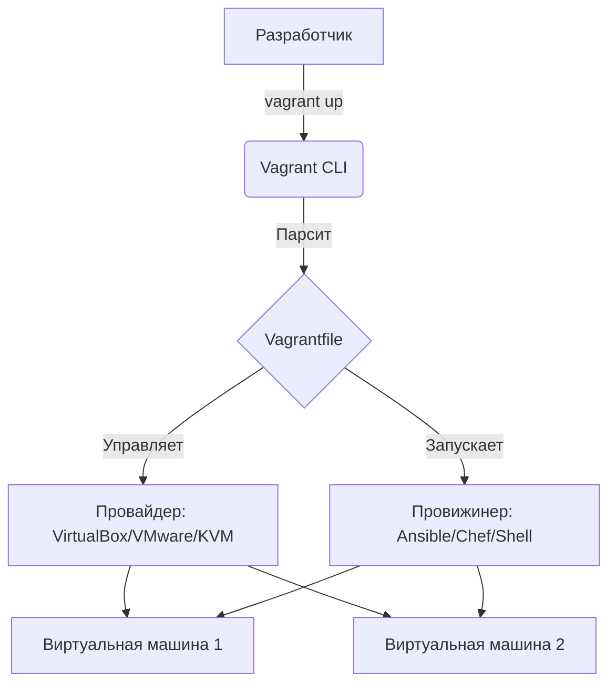

# Vagrant

## 📖 История: Боль и Решение
**Боль:** Разработчики тратили дни на настройку локального окружения, постоянно сталкиваясь с проблемой "а у меня работает!". Виртуальные машины создавались вручную, конфигурации терялись, а среды разработки кардинально отличались от продакшена.
**Решение:** Vagrant — инструмент для создания и настройки воспроизводимых, переносимых рабочих сред в виде виртуальных машин. Он позволяет описать инфраструктуру как код (Vagrantfile), обеспечивая идентичность окружения для всех членов команды.

## 🏗 Архитектура



## 💻 Примеры

### Базовый Vagrantfile (Ruby)
```ruby
Vagrant.configure("2") do |config|
  # Выбор базового образа (box)
  config.vm.box = "ubuntu/focal64"
  
  # Настройка сети
  config.vm.network "private_network", ip: "192.168.56.10"
  config.vm.network "forwarded_port", guest: 80, host: 8080

  # Выделение ресурсов
  config.vm.provider "virtualbox" do |vb|
    vb.memory = "2048"
    vb.cpus = 2
  end

  # Провижининг (настройка ВМ после создания)
  config.vm.provision "shell", inline: <<-SHELL
    apt-get update
    apt-get install -y nginx
  SHELL
end
```

### Основные команды
```bash
vagrant init ubuntu/focal64 # Создать начальный Vagrantfile
vagrant up                  # Поднять и настроить ВМ
vagrant ssh                 # Зайти внутрь ВМ
vagrant halt                # Выключить ВМ
vagrant destroy             # Удалить ВМ (полностью)
```

## 🛠 Day 2 Operations
- **Управление боксами:** Регулярно обновляйте базовые образы (`vagrant box update`), чтобы получать патчи безопасности.
- **Оптимизация производительности:** Используйте NFS или rsync для синхронизации папок (`config.vm.synced_folder`), стандартные средства VirtualBox могут сильно тормозить при большом количестве мелких файлов (например, в `node_modules`).
- **Снапшоты:** Активно используйте плагины или встроенные возможности для создания снапшотов перед рискованными изменениями внутри ВМ (`vagrant snapshot save`).

## ⚠️ Антипаттерны
- **Много ручной работы:** Поднятие ВМ через Vagrant, а затем ручная установка пакетов через `vagrant ssh`. *Решение:* Весь провижининг должен быть описан в Vagrantfile (shell, Ansible).
- **Хранение секретов:** Захардкоженные пароли или SSH-ключи в Vagrantfile, который коммитится в Git.
- **Один огромный Vagrantfile:** Описание десятков машин с разным назначением в одном файле без структурирования и использования циклов Ruby.
