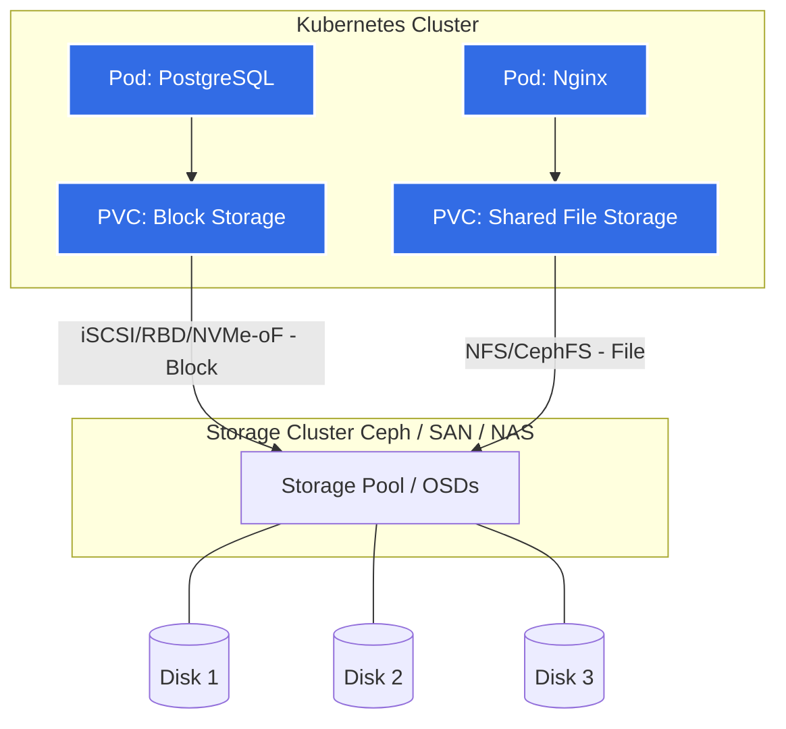

# Блочное и Файловое хранилище (SAN, NAS, Ceph, GlusterFS)

## 📖 История: Боль и решение
**Боль:** Мы запустили кластер Kubernetes, и приложениям (например, базам данных) потребовались персистентные диски (Persistent Volumes). Сначала мы привязывали поды к конкретным узлам (hostPath/local-path), но при падении узла база падала вместе с ним, и Kubernetes не мог перенести под на другой узел без потери данных.
**Решение:** Внедрение распределенного хранилища (Ceph / Rook) или использование SAN/NAS. Хранилище абстрагировалось от вычислительных узлов. Теперь, когда под с базой данных падает на одной ноде, Kubernetes поднимает его на другой, а распределенное хранилище прозрачно переподключает (attach) блочный том к новой ноде. Данные всегда доступны и реплицируются под капотом.

## 📐 Архитектура



## 🛠️ Примеры

### Kubernetes StorageClass для Ceph RBD (Блочное)
```yaml
apiVersion: storage.k8s.io/v1
kind: StorageClass
metadata:
  name: ceph-block
provisioner: rbd.csi.ceph.com
parameters:
  clusterID: <ceph-cluster-id>
  pool: replicapool
  imageFeatures: layering
  csi.storage.k8s.io/provisioner-secret-name: csi-rbd-secret
  csi.storage.k8s.io/provisioner-secret-namespace: ceph-system
reclaimPolicy: Delete
allowVolumeExpansion: true
```

### PVC и Pod с блочным хранилищем
```yaml
apiVersion: v1
kind: PersistentVolumeClaim
metadata:
  name: db-pvc
spec:
  accessModes:
    - ReadWriteOnce # Важно для блочного хранилища
  storageClassName: ceph-block
  resources:
    requests:
      storage: 50Gi
```

## ⚙️ Day 2 Operations
- **Capacity Management:** Внимательно следите за заполненностью пулов (в Ceph критический уровень `nearfull` и `full`). При достижении `full` ratio кластер блокирует запись, и все зависимые приложения падают. Добавляйте диски заранее.
- **IOPS / Throughput Monitoring:** Блочные хранилища чувствительны к задержкам (Latency). Следите за метриками утилизации дисков, IOPS и latency. Один "шумный сосед" (heavy I/O pod) может положить производительность всего кластера.
- **Rebalancing:** При добавлении или удалении дисков (OSD в Ceph) происходит ребалансировка данных. Ограничивайте скорость рекавери, чтобы не убить клиентский трафик во время ребаланса.

## ⚠️ Антипаттерны
1. **ReadWriteMany (RWX) на блочном хранилище:** Блочные устройства (RBD, EBS, iSCSI) по умолчанию не предназначены для одновременного монтирования на несколько узлов с правами записи (если это не кластерная ФС). Использование `ReadWriteMany` с обычным `ext4/xfs` приведет к коррупции данных. Для RWX используйте файловые хранилища (NFS, CephFS, GlusterFS).
2. **Базы данных поверх NFS:** Использование NFS (сетевой файловой системы) для хранения данных высоконагруженных СУБД. Вы получите высокие задержки (latency) и возможные проблемы с консистентностью. Для баз данных — только локальные NVMe или быстрые блочные хранилища (SAN/Ceph RBD).
3. **Отсутствие квот (Quotas):** Если не ограничивать размеры томов и не использовать Thin Provisioning с осторожностью, можно легко получить overcommit, когда логический объем выданных дисков превысит физический, что приведет к катастрофе при заполнении.
