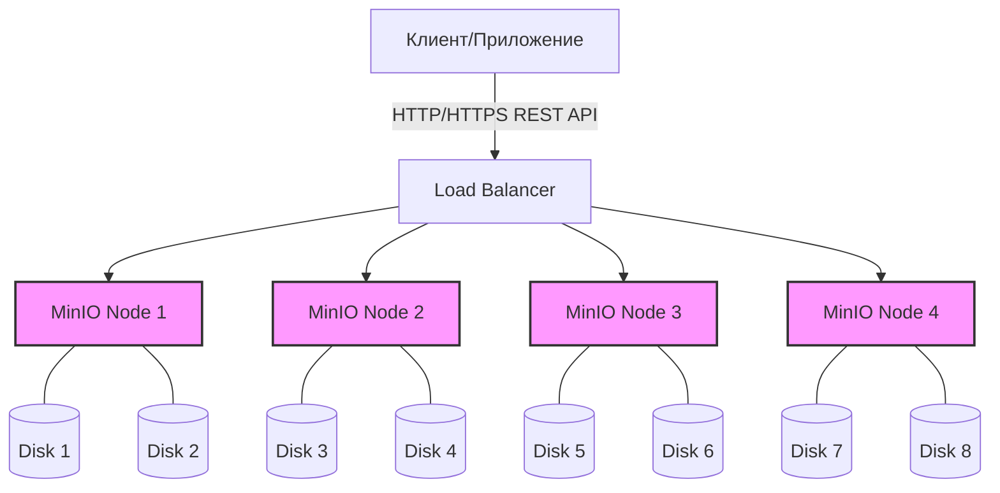

# Объектное хранилище (S3, MinIO)

## 📖 История: Боль и решение
**Боль:** Приложение росло, и пользователи начали загружать терабайты аватарок и документов. Сначала мы хранили их на обычной файловой системе сервера (NFS/локальный диск). Вскоре диски начали переполняться, бэкапы стали занимать вечность, а масштабирование требовало даунтаймов и сложных миграций данных. Разработчикам приходилось возиться с правами доступа POSIX.
**Решение:** Внедрение объектного хранилища по протоколу S3. Мы развернули MinIO (или использовали AWS S3). Данные стали храниться как объекты с метаданными по HTTP API. Бесконечное горизонтальное масштабирование, встроенные механизмы версионирования, жизненного цикла и управления доступом (IAM, пресайнд-ссылки) сняли головную боль инфраструктурной команды.

## 📐 Архитектура



## 🛠️ Примеры

### Docker Compose для MinIO
```yaml
version: '3.8'
services:
  minio:
    image: minio/minio:latest
    ports:
      - "9000:9000"
      - "9001:9001"
    environment:
      MINIO_ROOT_USER: admin
      MINIO_ROOT_PASSWORD: password123
    command: server /data --console-address ":9001"
    volumes:
      - minio_data:/data

volumes:
  minio_data:
```

### AWS CLI / MinIO Client (mc) - создание бакета и загрузка
```bash
# Настройка алиаса (mc)
mc alias set myminio http://localhost:9000 admin password123

# Создание бакета
mc mb myminio/images

# Загрузка файла
mc cp avatar.jpg myminio/images/

# Настройка политики (публичное чтение)
mc anonymous set download myminio/images
```

## ⚙️ Day 2 Operations
- **Lifecycle Policies:** Настройте правила жизненного цикла для автоматического удаления старых данных или их перемещения в более дешевое хранилище (Tiering), иначе стоимость/размер хранилища улетят в космос.
- **Monitoring:** Обязательно собирайте метрики через Prometheus (MinIO отдает их из коробки на `/minio/v2/metrics/cluster`). Следите за доступностью дисков (drive offline) и кворумом.
- **Backups:** Несмотря на Erasure Coding в MinIO, настраивайте репликацию (Site-to-Site) или делайте бэкапы критичных бакетов в другой кластер/в облако на случай логического удаления или компрометации (Ransomware). Используйте Object Lock (WORM).

## ⚠️ Антипаттерны
1. **Использование S3 как файловой системы:** Попытки монтировать S3 через s3fs/goofys для активного I/O или работы с базами данных (SQLite). S3 — это объектное хранилище, а не POSIX-совместимая ФС, оно не подходит для частых мелких изменений файлов (high latency, нет блокировок файлов).
2. **Публичные бакеты по умолчанию:** Выдача публичного доступа на весь бакет, вместо использования Pre-signed URLs для временного доступа к конкретным объектам.
3. **Бесконечный рост версий:** Включение версионирования объектов (Versioning) без настройки Lifecycle rules для удаления старых версий.
