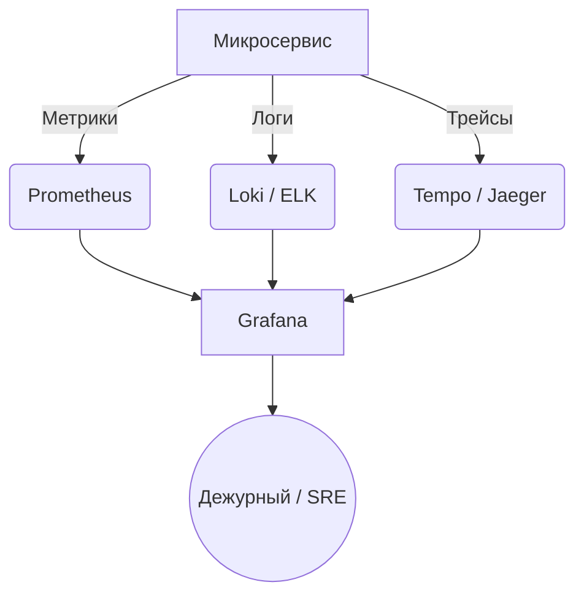

# 00 Основы Observability

## DevOps-история: От слепоты к прозрению
**Боль:** Микросервисная архитектура разрослась. Пользователи жалуются на медленную работу сайта, а команда бэкенда говорит "у нас все ок, смотрите сеть" или "база тормозит". Логи разбросаны по 50 серверам, никто не знает, как запрос проходит от фронтенда до базы данных.
**Решение:** Внедрение трех столпов наблюдаемости (Observability) — логов, метрик и трейсов. Интеграция их в единую систему (например, Prometheus + Grafana + Jaeger/Tempo), что позволило видеть полную картину (Golden Signals: Latency, Traffic, Errors, Saturation) и сократить MTTR с часов до минут.

## Архитектура: Три столпа Observability



## Примеры (Инструментарий)
### Пример метрик (Prometheus format)
```text
# HELP http_requests_total The total number of HTTP requests.
# TYPE http_requests_total counter
http_requests_total{method="post",code="200"} 1027 1395066363000
```

## Day 2 Operations
- **Alert Fatigue:** Не делайте алерты на каждую мелочь. Настройте их на симптомы (например, высокий процент ошибок или большая задержка для пользователя), а не на причины (высокий CPU).
- **Retention Policies:** Настройте правильные политики хранения. Долговременное хранение сырых логов дорого; используйте даунсэмплинг (downsampling) для старых метрик.

## Антипаттерны
- **Logging Everything (Сбор всего подряд):** Запись в логи каждого чиха съедает место на диске и замедляет поиск. Пишите только важную информацию и структурируйте (JSON).
- **"Dashboards everywhere":** Создание 100500 дашбордов, в которых никто не может разобраться. Делайте единый дашборд с высокоуровневым обзором и возможностью провалиться (drill-down) в детали.
