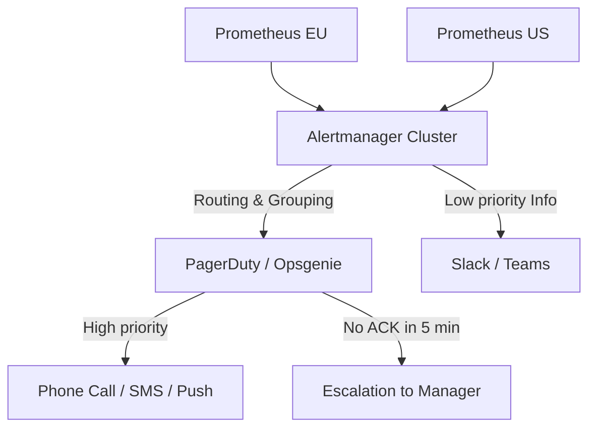

# Alerting (Alertmanager, PagerDuty, Opsgenie)

## 📖 DevOps-история
**Боль:** В 3 часа ночи упал один критичный микросервис, что вызвало каскадный сбой. Дежурному инженеру пришло 500 писем и пушей с алертами "High CPU", "Service Down" и "DB connection failed" от разных систем. Понять, с чего начать — невозможно (классический *Alert Fatigue*).
**Решение:** Внедрение Alertmanager для дедупликации и группировки похожих алертов + PagerDuty/Opsgenie для маршрутизации, эскалации и звонков дежурным. Теперь при сбое приходит один сводный инцидент с ссылкой на runbook, а если первый дежурный не отвечает — система звонит второму.

## 🏗 Архитектура



## 💻 Примеры

**Пример конфигурации `alertmanager.yml` (Группировка и роутинг):**
```yaml
route:
  group_by: ['alertname', 'cluster', 'service']
  group_wait: 30s      # Ждем 30с перед отправкой, чтобы собрать пачку связанных алертов
  group_interval: 5m   # Следующая отправка обновлений по той же группе через 5м
  repeat_interval: 3h  # Напоминание, если алерт не закрыт
  receiver: 'slack-default'
  routes:
    - matchers:
        - severity="critical"
      receiver: 'pagerduty-critical'

receivers:
- name: 'slack-default'
  slack_configs:
  - api_url: 'https://hooks.slack.com/services/T00000000/B00000000/XXXX'
- name: 'pagerduty-critical'
  pagerduty_configs:
  - service_key: '<pd-integration-key>'
```

## 🛠 Day 2 Operations
- **Тюнинг алертов (Alert Tuning):** Регулярный пересмотр сработавших алертов. Золотое правило: если алерт сработал, но инженер ничего не сделал — этот алерт нужно удалить или понизить его приоритет (убрать из PagerDuty в Slack).
- **Runbooks (Playbooks):** Каждый критичный алерт должен содержать аннотацию `runbook_url` со ссылкой на Wiki, где описана пошаговая инструкция по диагностике.
- **On-call Rotations:** Настройка справедливых дежурств (смен) в PagerDuty/Opsgenie. Важно учитывать часовые пояса (Follow-the-sun), выходные, отпуска и эскалационные политики.

## 🚫 Антипаттерны
1. **Алерты на симптомы, а не на влияние (Impact):** Алерт "CPU > 90%" — плохой (сервис может нормально работать под нагрузкой). Алерт "Latency > 1s" или "Error Rate > 5%" (страдает пользователь) — хороший. Подход RED/USE.
2. **Отсутствие эскалации:** Отправка критичных уведомлений только в Slack или на Email, который никто не читает ночью.
3. **"Мальчик, который кричал волки":** Игнорирование регулярных ложных срабатываний без изменения порогов (thresholds). В итоге инженеры привыкают к "красному" экрану и пропускают настоящий сбой.
