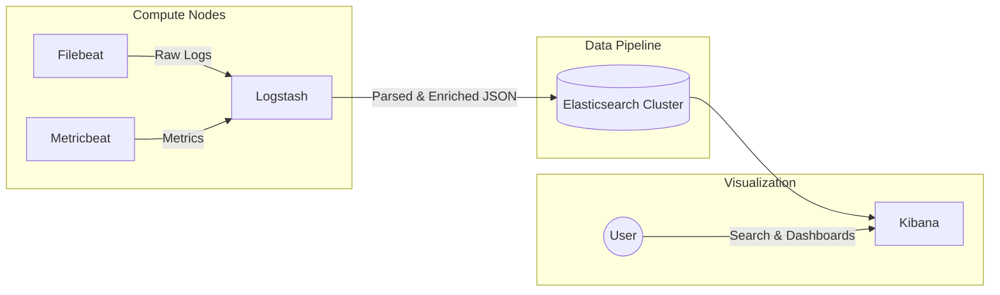

# Elastic Stack (Elasticsearch, Logstash, Kibana, Beats)

## 📖 DevOps-история
**Боль:** Разработчики часами искали причину бага, заходя по SSH на 20 разных серверов и "грепая" гигабайтные логи (`grep "ERROR" /var/log/app.log`). Когда логи ротировались, история терялась навсегда. Корреляция событий между микросервисами была невозможна.
**Решение:** Внедрение Elastic Stack (ELK). Beats (легковесные агенты) собирают логи локально, Logstash парсит, фильтрует и обогащает их, Elasticsearch индексирует для мгновенного поиска, а в Kibana строятся удобные дашборды для аналитики ошибок и мониторинга безопасности.

## 🏗 Архитектура



## 💻 Примеры

**Пример конфигурации `filebeat.yml`:**
```yaml
filebeat.inputs:
- type: log
  enabled: true
  paths:
    - /var/log/nginx/*.log
  fields:
    app: frontend
    env: production

output.logstash:
  hosts: ["logstash.internal:5044"]
```

**Пример Logstash pipeline (`logstash.conf`):**
```logstash
input {
  beats {
    port => 5044
  }
}

filter {
  if [fields][app] == "frontend" {
    grok {
      match => { "message" => "%{COMBINEDAPACHELOG}" }
    }
    date {
      match => [ "timestamp" , "dd/MMM/yyyy:HH:mm:ss Z" ]
    }
  }
}

output {
  elasticsearch {
    hosts => ["http://elasticsearch:9200"]
    index => "%{[fields][app]}-%{+YYYY.MM.dd}"
  }
}
```

## 🛠 Day 2 Operations
- **Index Lifecycle Management (ILM):** Настройка автоматического перевода старых индексов на дешевые диски (Hot-Warm-Cold архитектура) и их удаление (Delete phase) через 30-90 дней для экономии места.
- **Управление шардами:** Оптимальный размер шарда — от 10GB до 50GB. Избегайте проблемы *Oversharding* (сотни крошечных шардов), так как это перегружает Heap на Master-нодах.
- **Mapping и Templates:** Использование Dynamic Mapping с осторожностью. Лучше задавать строгие шаблоны индексов (Index Templates), чтобы случайная строка в логе не привела к конфликту типов (например, распарсилась как дата).

## 🚫 Антипаттерны
1. **Elasticsearch как реляционная база данных:** Использование ES как первичного источника правды (Source of Truth). ES — это поисковый движок, он может терять данные при split-brain сценариях.
2. **Сбор "мусорных" логов:** Отправка DEBUG или TRACE логов с продакшена в ES "на всякий случай". Это экспоненциально увеличивает стоимость инфраструктуры хранения и замедляет поиск.
3. **Отсутствие буферизации на входе:** Прямая запись из 1000 Beats прямо в Elasticsearch. При всплеске логов (например, во время сбоя) ES упадет от нагрузки. Лучше использовать Logstash, Redis или Kafka в качестве буфера (Message Queue).
