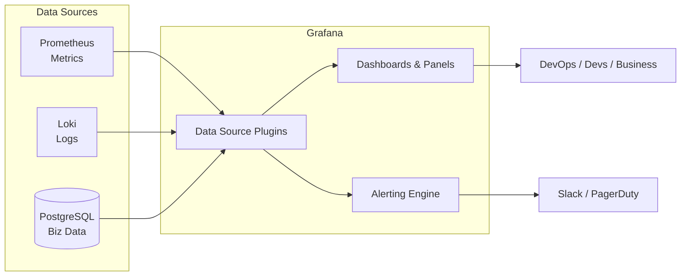

# Grafana: Основы, Дашборды и Провайдеры

## 📖 История: Боль и Решение

**Боль:** У вас есть Prometheus, Elasticsearch, базы данных PostgreSQL — все они собирают терабайты ценных данных. Но когда падает продакшен, инженеры начинают судорожно выполнять запросы в консоли, переключаясь между вкладками и пытаясь сопоставить логи из Kibana с метриками из Prometheus. Время реакции (MTTR) огромное, бизнес теряет деньги.

**Решение:** Внедрение Grafana как единого "стекла" (Single Pane of Glass). Grafana подключается ко всем этим источникам данных (Data Sources) и выводит их на единые, красивые и понятные дашборды. Теперь при инциденте вся нужная информация находится перед глазами на одном экране.

## 🗺️ Схема Архитектуры (Источники данных)



## 💻 Примеры Конфигурации

### 1. Provisioning Data Sources (YAML)
Никогда не добавляйте источники руками через UI. Используйте provisioning (IaC):
```yaml
# /etc/grafana/provisioning/datasources/prometheus.yaml
apiVersion: 1
datasources:
  - name: Prometheus
    type: prometheus
    access: proxy
    url: http://prometheus:9090
    isDefault: true
    version: 1
    editable: false
  - name: Loki
    type: loki
    access: proxy
    url: http://loki:3100
    version: 1
    editable: false
```

### 2. Пример простого Dashboard (JSON фрагмент)
Вместо хранения в JSON, дашборды лучше описывать кодом (например, через Terraform или Jsonnet). Фрагмент панели:
```json
{
  "type": "timeseries",
  "title": "CPU Usage",
  "gridPos": { "h": 8, "w": 12, "x": 0, "y": 0 },
  "targets": [
    {
      "expr": "100 - (avg by (instance) (irate(node_cpu_seconds_total{mode=\"idle\"}[5m])) * 100)",
      "legendFormat": "{{instance}}",
      "refId": "A"
    }
  ]
}
```

## 🛠️ Day 2 Operations (Советы по эксплуатации)

- **Dashboards as Code:** Используйте Grafana Provisioning для автоматической загрузки дашбордов из папки или ConfigMaps (в Kubernetes). Не позволяйте править дашборды в Production-окружении напрямую через UI (`editable: false`).
- **Переменные (Variables):** Используйте переменные шаблонов (Template Variables) для переключения между окружениями, кластерами и серверами. Избегайте хардкода (например, `cluster="prod"`) прямо в запросах панелей.
- **Аннотации (Annotations):** Настройте вывод деплоев (из GitLab CI или ArgoCD) как аннотации на графиках. Это мгновенно отвечает на вопрос: "А не после деплоя ли у нас подскочило потребление памяти?".

## 🚫 Антипаттерны

1. **Тяжелые запросы на рефреше:** Установка Auto-refresh на 1 или 5 секунд на дашборде с тяжелыми запросами к PromQL/Loki. Это положит ваши источники данных. Оптимально — 30s или 1m.
2. **Свалка панелей:** Размещение 50 графиков на одном дашборде. Дашборд должен отвечать на конкретный вопрос. Используйте подход RED (Rate, Errors, Duration) или USE (Utilization, Saturation, Errors) для верхнеуровневых метрик, а детали прячьте в drill-down дашборды.
3. **Ручное создание пользователей:** Заведение пользователей руками. Используйте интеграцию с LDAP, OAuth (Google/GitHub/GitLab) или SAML для единого входа и маппинга групп.
