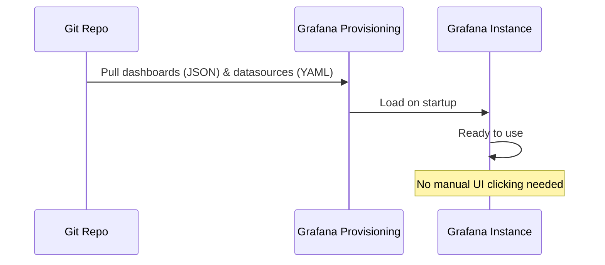

# Grafana: Dashboards, Data Sources, Provisioning

## DevOps-история: Дашборд как код
**Боль:** Аналитики и инженеры постоянно создают дашборды вручную (ClickOps) прямо в UI Grafana. При падении Grafana или переезде на другой кластер все дашборды и настроенные источники данных (Data Sources) теряются. Приходится восстанавливать их из памяти или бэкапов БД.
**Решение:** Переход на концепцию Infrastructure as Code (IaC) для Grafana — **Provisioning**. Настройка Grafana через конфигурационные файлы (YAML) и загрузка дашбордов из JSON-файлов (или генерация через Jsonnet/Grafonnet). Теперь инфраструктура Grafana версионируется в Git и поднимается за секунды.

## Схема Provisioning



## Примеры
### Provisioning источника данных (datasource.yaml)
```yaml
apiVersion: 1
datasources:
  - name: Prometheus
    type: prometheus
    access: proxy
    url: http://prometheus:9090
    isDefault: true
    editable: false # Запрещает изменение через UI
```

### Provisioning дашбордов (dashboards.yaml)
```yaml
apiVersion: 1
providers:
  - name: 'default'
    orgId: 1
    folder: ''
    type: file
    disableDeletion: false
    editable: true
    options:
      path: /var/lib/grafana/dashboards
```

## Day 2 Operations
- **Variables & Templating:** Максимально используйте переменные (cluster, namespace, pod) в дашбордах, чтобы один дашборд мог обслуживать множество сред (dev, stg, prod).
- **Grafonnet/Cuetils:** Для больших организаций генерируйте дашборды программно, вместо хранения гигантских нечитаемых JSON-файлов.

## Антипаттерны
- **Смешивание Provisioning и UI:** Если вы настраиваете Data Sources через provisioning (`editable: false`), но кто-то пытается изменить их через API/UI, изменения не сохранятся при рестарте.
- **Тяжелые запросы на автообновлении:** Дашборд, который делает `rate()` по огромному объему данных за последние 30 дней с автообновлением каждые 5 секунд, убьет ваш Prometheus.
