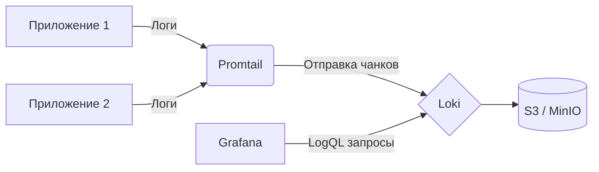

# Loki и Promtail

## 📖 История: Боль и Решение
**Боль:** ELK-стек (Elasticsearch, Logstash, Kibana) съедал все ресурсы кластера на индексацию огромного объема логов, большинство из которых мы даже не читали. Поддержка Elasticsearch превратилась в отдельную фулл-тайм работу.
**Решение:** Внедрение Grafana Loki и Promtail. Loki индексирует только метаданные (метки/лейблы), а не сам текст логов, что делает его невероятно легковесным и дешевым. А интеграция с Grafana позволяет смотреть логи и метрики в одном окне.

## 🏗 Архитектура



## 💻 Примеры

### Базовый конфиг Promtail (promtail-config.yaml)
```yaml
server:
  http_listen_port: 9080

positions:
  filename: /tmp/positions.yaml

clients:
  - url: http://loki:3100/loki/api/v1/push

scrape_configs:
- job_name: system
  static_configs:
  - targets:
      - localhost
    labels:
      job: varlogs
      __path__: /var/log/*log
```

### LogQL Запрос
Поиск ошибок в конкретном поде за последний час:
```logql
{app="frontend", namespace="production"} |= "error" | json | status >= 500
```

## 🛠 Day 2 Operations (Советы по эксплуатации)
- **Хранение в Object Storage:** Используйте S3 (AWS, MinIO) для долговременного хранения чанков (chunks). Это значительно дешевле и проще в масштабировании, чем локальные диски.
- **Ограничение Retention:** Настройте `retention_period` в Loki (например, 14 или 30 дней) и Table Manager (или Compactor) для автоматического удаления старых логов.
- **Мониторинг самого Loki:** Обязательно собирайте метрики с Loki. Следите за `loki_request_duration_seconds` и `loki_ingester_memory_bytes`.
- **Лимиты (Limits):** Настройте `ingestion_rate_mb` и `per_stream_rate_limit`, чтобы один "шумный" сервис не положил весь кластер логирования.

## ⚠️ Антипаттерны
- ❌ **Слишком много лейблов (High Cardinality):** Использование уникальных идентификаторов (например, `user_id` или `request_id`) в качестве лейблов. Это убьет производительность Loki (каждая комбинация лейблов создает новый стрим). *Правильно: фильтровать такие данные через LogQL (`|= "user_id=123"`).*
- ❌ **Парсинг логов на стороне Promtail:** Попытки распарсить весь JSON в лейблы на этапе сбора. *Правильно: отправлять сырой JSON и парсить его при запросе в Grafana (`| json`).*
- ❌ **Отсутствие алертов на молчание логов:** Не настроить алерты на падение самого Promtail или отсутствие логов от критичных сервисов более N минут.
