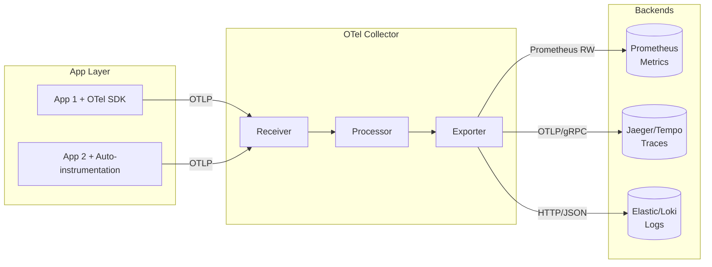

# OpenTelemetry (Единый стандарт)

## 📖 DevOps-история
**Боль:** Исторически для каждой системы мониторинга (Prometheus, Jaeger, Datadog, New Relic) требовались свои библиотеки и агенты в коде. Разработчики тратили время на интеграцию десятка SDK, а инфраструктура страдала от раздутого количества агентов на серверах. Миграция на другой инструмент мониторинга означала переписывание кода.
**Решение:** OpenTelemetry (OTel) — единый открытый стандарт и набор инструментов (SDK, API, агенты) для генерации, сбора и экспорта метрик, логов и трейсов (telemetry data). Теперь приложение использует один OTel SDK, шлет данные в OTel Collector, а тот уже роутит их в любые бэкенды.

## 🏗 Архитектура



## 💻 Примеры

### Базовый конфиг OTel Collector (`otel-collector-config.yaml`)
```yaml
receivers:
  otlp:
    protocols:
      grpc:
        endpoint: 0.0.0.0:4317
      http:
        endpoint: 0.0.0.0:4318

processors:
  batch:
    timeout: 1s
    send_batch_size: 1024
  memory_limiter:
    check_interval: 1s
    limit_mib: 1000
    spike_limit_mib: 200

exporters:
  prometheusremotewrite:
    endpoint: "http://prometheus:9090/api/v1/write"
  otlp/tempo:
    endpoint: "tempo:4317"
    tls:
      insecure: true

service:
  pipelines:
    metrics:
      receivers: [otlp]
      processors: [memory_limiter, batch]
      exporters: [prometheusremotewrite]
    traces:
      receivers: [otlp]
      processors: [memory_limiter, batch]
      exporters: [otlp/tempo]
```

## 🛠 Day 2 Operations
- **Сэмплирование (Sampling):** В Production используйте *Tail-based sampling* на уровне OTel Collector, чтобы сохранять только трейсы с ошибками или высокой задержкой, отбрасывая успешные 200 OK запросы. Это спасет бюджет и место на диске.
- **Масштабирование:** Разделяйте сборщиков на *DaemonSet* (Agent mode) на каждом узле для сбора локальных данных и *Deployment* (Gateway mode) для тяжелой обработки (tail-based sampling, обогащение) перед отправкой в бэкенд.
- **Очереди и Батчинг:** Всегда используйте `batch` процессор для группировки данных перед отправкой в экспортеры. Это снижает нагрузку на сеть и бэкенды.

## 🚫 Антипаттерны
- **Отсутствие `memory_limiter`:** Запуск коллектора без процессора ограничения памяти. При спайке трафика коллектор уйдет в OOMKilled, потеряв данные.
- **100% трейсинг в Production:** Запись всех трейсов подряд. Приведет к колоссальным расходам на хранилище данных и деградации производительности сети.
- **Прямая отправка в бэкенд без Gateway:** Когда сотни микросервисов шлют данные напрямую в бэкенды мониторинга, минуя централизованный OTel Gateway Collector. Теряется возможность централизованно фильтровать, обогащать и менять бэкенды без редеплоя приложений.
