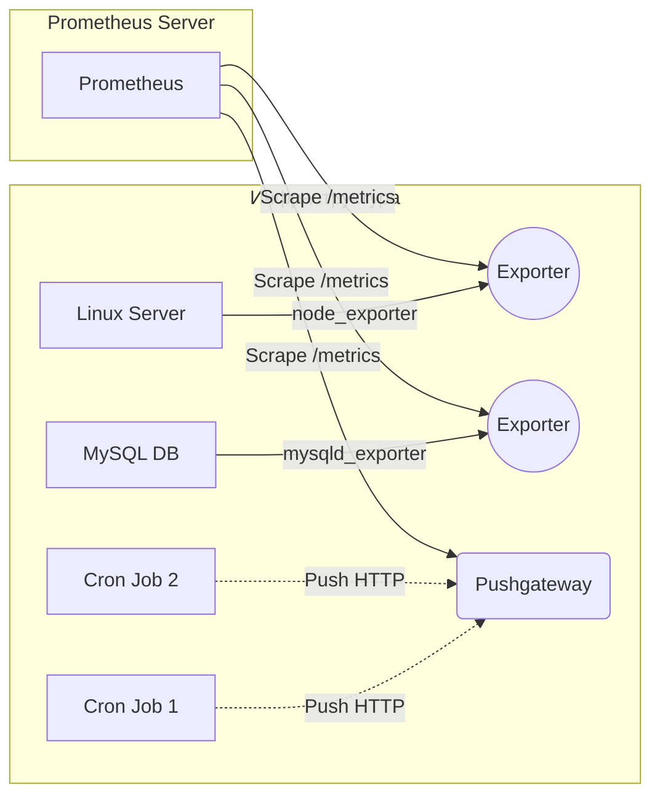

# Prometheus: Exporters и Pushgateway

## 📖 История: Боль и Решение
**Боль:** Prometheus отлично собирает метрики, но что делать с системами, которые ничего не знают про формат Prometheus (например, базы данных, старое железо, сторонние API)? Или как мониторить короткоживущие скрипты (cron-job), которые завершаются быстрее, чем Prometheus успевает их опросить (scrape)?
**Решение:** 
- **Exporters:** Сторонние агенты, которые транслируют метрики из специфичных форматов (MySQL, Linux OS) в формат Prometheus.
- **Pushgateway:** Промежуточный кэш метрик. Короткоживущие джобы пушат метрики в Pushgateway, а Prometheus уже спокойно собирает их оттуда.

## 🏗 Архитектура



## 💻 Примеры

### Запуск Node Exporter (Bash/Docker)
```bash
# Запуск через Docker
docker run -d \
  --net="host" \
  --pid="host" \
  -v "/:/host:ro,rslave" \
  quay.io/prometheus/node-exporter:latest \
  --path.rootfs=/host
```

### Отправка метрики в Pushgateway (Bash)
```bash
# Скрипт бэкапа
start_time=$(date +%s)
# ... логика бэкапа ...
end_time=$(date +%s)
duration=$((end_time - start_time))

# Отправляем метрику длительности в Pushgateway
echo "backup_duration_seconds $duration" | curl --data-binary @- http://pushgateway:9091/metrics/job/db_backup/instance/db1
```

### Настройка Prometheus (prometheus.yml)
```yaml
scrape_configs:
  - job_name: 'node_exporter'
    static_configs:
      - targets: ['10.0.0.5:9100']
      
  - job_name: 'pushgateway'
    honor_labels: true # Важно! Чтобы сохранялись оригинальные лейблы от джобов
    static_configs:
      - targets: ['pushgateway:9091']
```

## 🛠 Day 2 Operations
- **Безопасность Pushgateway:** Pushgateway не имеет встроенной аутентификации. Закрывайте его с помощью Reverse Proxy (Nginx/HAProxy) с Basic Auth или mTLS.
- **Управление лейблами:** При использовании Pushgateway всегда используйте `honor_labels: true` в настройках Prometheus, иначе метрики будут иметь лейблы самого Pushgateway, а не джоба, который их отправил.
- **Мониторинг экспортеров:** Всегда собирайте метрики `up{job="node_exporter"}`, чтобы знать, когда экспортер падает и метрики перестают поступать.

## ⚠️ Антипаттерны
- **Pushgateway для постоянных сервисов:** Использование Pushgateway для микросервисов вместо того, чтобы Prometheus сам ходил к ним (pull-модель). *Почему плохо:* Pushgateway становится единой точкой отказа и бутылочным горлышком. Он предназначен ТОЛЬКО для ephemeral (короткоживущих) задач.
- **Забытые метрики в Pushgateway:** Pushgateway хранит метрики вечно, пока их не удалят через API. Если cron-job изменил имя метрики, старая навсегда останется в Pushgateway. *Решение:* Отправлять DELETE запрос или настроить TTL для метрик (хотя штатно Pushgateway не поддерживает TTL, используют костыли).
- **Слишком много экспортеров на одном хосте:** Разворачивание десятков мелких экспортеров вместо использования/написания одного комбинированного, что усложняет управление портами и конфигурацией.
