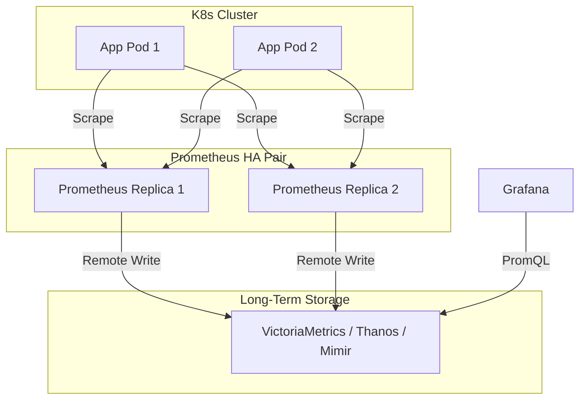

# Prometheus: Storage, Remote Write-Read, HA

## 📖 История: Боль и Решение

**Боль:** Ваш Prometheus собирал метрики со всех серверов, всё было отлично. Но затем нагрузка выросла. TSDB (Time Series Database) начала пухнуть, диск переполнился, и Prometheus упал. При попытке масштабировать выяснилось, что Prometheus из коробки не умеет в кластеризацию. К тому же, метрики нужно хранить долго (годы), а локальный диск для этого не подходит.

**Решение:** Внедрение Remote Write для отправки метрик во внешнее хранилище (например, VictoriaMetrics, Thanos, Mimir) и настройка High Availability (HA) пар Prometheus, которые дублируют сбор метрик (с дедупликацией на стороне глобального хранилища).

## 🗺️ Схема Архитектуры (HA & Remote Write)



## 💻 Примеры Конфигурации

### 1. Настройка Remote Write (prometheus.yml)
```yaml
global:
  scrape_interval: 15s
  external_labels:
    cluster: 'prod-eu-west-1'
    replica: '0' # У второй реплики будет '1'

scrape_configs:
  - job_name: 'node-exporter'
    static_configs:
      - targets: ['localhost:9100']

# Отправка данных во внешнее хранилище
remote_write:
  - url: "http://victoriametrics:8428/api/v1/write"
    queue_config:
      max_samples_per_send: 10000
      capacity: 20000
      max_shards: 10
```

### 2. Настройка retention для локального TSDB (bash/systemd)
Для HA и Remote Write локальный диск нужен только как буфер. Уменьшаем срок хранения:
```bash
# Флаги запуска Prometheus
--storage.tsdb.retention.time=24h \
--storage.tsdb.path=/var/lib/prometheus \
--storage.tsdb.wal-compression
```

## 🛠️ Day 2 Operations (Советы по эксплуатации)

- **Мониторинг очередей:** Обязательно настройте алерты на метрики `prometheus_remote_storage_highest_timestamp_in_seconds` и `prometheus_remote_storage_queue_highest_sent_timestamp_seconds`. Разница между ними — это ваш lag.
- **Очистка WAL:** Если `remote_write` отвалился, локальный WAL (Write-Ahead Log) начнёт расти. Рассчитывайте размер диска на Prometheus с учётом времени, которое вам потребуется на починку внешнего хранилища (например, буфер на 6-12 часов).
- **Сжатие:** Всегда включайте `--storage.tsdb.wal-compression`, это сэкономит I/O и место.

## 🚫 Антипаттерны

1. **Долгое хранение метрик локально в HA:** Попытка хранить год метрик прямо на дисках двух Prometheus-серверов. Это дорого и сложно бэкапить. Используйте решения вроде Thanos или VictoriaMetrics.
2. **Отсутствие external_labels:** Если вы используете HA (2 реплики Prometheus), но не задали им разные `external_labels` (например, `replica: A` и `replica: B`), внешнее хранилище не сможет правильно дедуплицировать метрики.
3. **Огромный `max_shards` при старте:** Не завышайте количество шардов для `remote_write` "на всякий случай", это приведет к перерасходу памяти. Оставьте значения по умолчанию или тюньте только при появлении лага.
