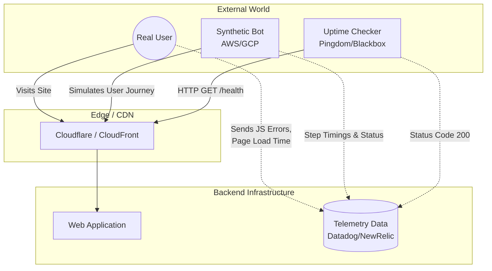

# Uptime, Synthetic, RUM

## 📖 DevOps-история: Боль и Решение

**Боль:** Система мониторинга зеленая. Базы данных работают, APM не показывает задержек на бэкенде. Но клиенты из Европы не могут добавить товар в корзину. Оказывается, сломался скрипт на фронтенде в определенной версии браузера, или отвалился CDN провайдер. Внутренний мониторинг слеп к тому, что реально происходит в браузере пользователя.

**Решение:** Комбинация внешних проверок и мониторинга со стороны клиента:
* **Uptime Monitoring:** Базовые проверки "жив ли сервис" снаружи (из разных географических точек).
* **Synthetic Monitoring:** Боты, имитирующие действия пользователя (логин, добавление в корзину, оплата), запускаемые по расписанию.
* **RUM (Real User Monitoring):** Сбор метрик производительности и ошибок напрямую из браузера реальных пользователей (Core Web Vitals, JS errors).

## 📊 Архитектура (Mermaid)



## 💻 Примеры

**1. Uptime: Prometheus Blackbox Exporter (YAML):**
```yaml
modules:
  http_2xx:
    prober: http
    http:
      valid_http_versions: ["HTTP/1.1", "HTTP/2.0"]
      valid_status_codes: []  # Defaults to 2xx
      method: GET
      no_follow_redirects: false
      fail_if_ssl: false
      fail_if_not_ssl: true
```

**2. RUM: Инициализация Datadog RUM в браузере (JavaScript):**
```javascript
import { datadogRum } from '@datadog/browser-rum';

datadogRum.init({
    applicationId: 'YOUR_APP_ID',
    clientToken: 'YOUR_CLIENT_TOKEN',
    site: 'datadoghq.com',
    service: 'frontend-shop',
    env: 'production',
    sessionSampleRate: 100,
    sessionReplaySampleRate: 20,
    trackUserInteractions: true,
    trackResources: true,
    trackLongTasks: true,
    defaultPrivacyLevel: 'mask-user-input',
});
datadogRum.startSessionReplayRecording();
```

**3. Synthetic: Простой сценарий на Playwright (TypeScript):**
```typescript
import { test, expect } from '@playwright/test';

test('Critical user journey: Add to cart', async ({ page }) => {
  await page.goto('https://shop.example.com');
  await page.click('text=Login');
  await page.fill('#username', 'test_user');
  await page.fill('#password', process.env.TEST_PASS!);
  await page.click('button[type="submit"]');
  
  await expect(page.locator('.user-greeting')).toContainText('Hello');
  
  await page.click('.product-item >> text=Add to Cart');
  await expect(page.locator('.cart-count')).toHaveText('1');
});
```

## 🛠 Day 2 Operations (Советы по эксплуатации)

1. **Синхронизация Синтетики и Фронтенда:** Включите запуск Synthetic-тестов в CI/CD пайплайн фронтенда. Если верстка меняется, тест должен падать до деплоя в прод, а не будить дежурного ночью ложным алертом.
2. **Фильтрация шума в RUM:** Исключите из RUM трафик от поисковых ботов, собственных Synthetic-чекеров и офисных IP-адресов, чтобы видеть реальную картину.
3. **Гео-распределенный Uptime:** Проверяйте доступность не только из одного региона. Используйте минимум 3 разные локации для защиты от локальных проблем связности.
4. **Трассировка End-to-End:** Настройте связывание (Correlation) RUM и APM. При получении ошибки в браузере, вы должны иметь возможность провалиться в trace конкретного запроса к базе данных.

## 🛑 Антипаттерны

* **Только Uptime (Ping):** Считать сервис рабочим только на основе ответа `200 OK` от главной страницы, игнорируя бизнес-логику (например, неработающую оплату).
* **Хрупкие Synthetic-тесты:** Использование CSS/XPath селекторов, которые меняются при каждом деплое. Лучше использовать `data-testid`.
* **Игнорирование Core Web Vitals:** Сбор RUM-метрик без их анализа. Если LCP (Largest Contentful Paint) составляет 10 секунд, пользователи уходят, даже если нет 500-х ошибок.
* **Тестирование на Production данных:** Synthetic тесты делают реальные заказы и списывают деньги, портя бизнес-аналитику. (Решение: использовать специальные тестовые аккаунты с пометкой для игнора в аналитике).
