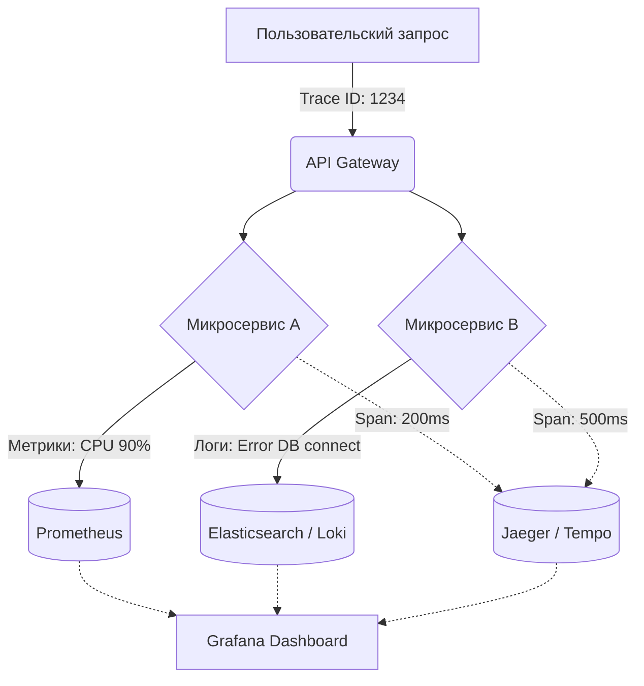

# Метрики, Логи, Трейсинг (Три столпа)

## DevOps-история (Боль и Решение)
**Боль:** Сервис падает в продакшене. Пользователи жалуются на ошибки 500, но в логах — миллионы строк, и непонятно, с чего начать. CPU скачет, база данных тормозит, а запросы теряются где-то между микросервисами. На расследование уходят часы.
**Решение:** Внедрение трех столпов наблюдаемости. Метрики (Metrics) показывают, *что* сломалось. Трейсы (Traces) показывают, *где* сломалось. Логи (Logs) показывают, *почему* сломалось.

## Mermaid-схема



## Примеры

### Метрики (Prometheus - Python Client)
```python
from prometheus_client import Counter

REQUESTS = Counter('http_requests_total', 'Total HTTP requests', ['method', 'endpoint'])

def handle_request():
    REQUESTS.labels(method='GET', endpoint='/api/v1/users').inc()
    # бизнес-логика
```

### Логи (JSON формат)
```json
{"timestamp": "2026-07-25T20:20:00Z", "level": "ERROR", "trace_id": "a1b2c3d4", "service": "auth", "msg": "Failed to connect to Redis", "error_code": "DB_TIMEOUT"}
```

### Трейсинг (OpenTelemetry - Envoy YAML)
```yaml
tracing:
  http:
    name: envoy.tracers.opentelemetry
    typed_config:
      "@type": type.googleapis.com/envoy.config.trace.v3.OpenTelemetryConfig
      grpc_service:
        envoy_grpc:
          cluster_name: opentelemetry_collector
```

## Советы Day 2 operations
- **Корреляция — это ключ:** Всегда добавляйте `trace_id` во все логи. Это позволяет мгновенно найти логи, относящиеся к медленному трейсу.
- **Сэмплирование трейсов:** Не храните 100% трейсов в высоконагруженных системах (tail-based sampling, храните только ошибки и аномалии).
- **Многоуровневое хранение логов (Tiered Storage):** Горячие логи в памяти/SSD на 7 дней, холодные — в S3 (например, через Loki).
- **Унификация форматов:** Используйте структурированные логи (JSON) везде.

## Антипаттерны
- ❌ **Логирование всего подряд:** Приводит к огромным счетам за хранение и невозможности найти нужную информацию (иголка в стоге сена).
- ❌ **Метрики с высокой кардинальностью (High Cardinality):** Использование ID пользователей или URL с параметрами как лейблов в Prometheus убьет ваш TSDB.
- ❌ **Изолированные инструменты:** Метрики в одной системе, логи в другой, без возможности перехода (drill-down) между ними.
