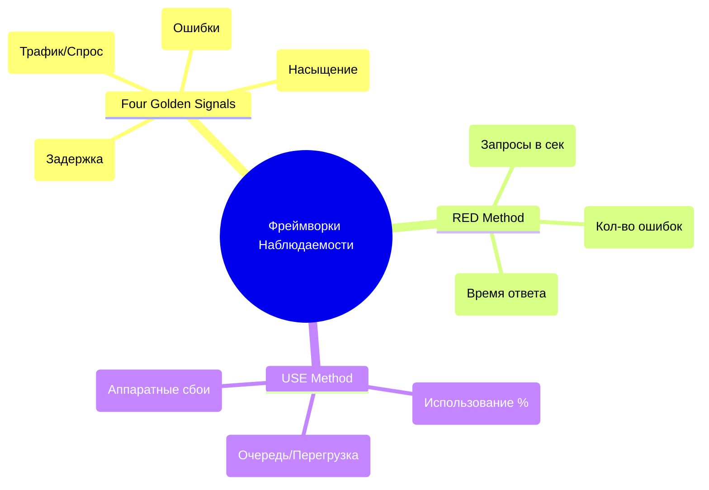

# Сигналы (Four Golden Signals, RED, USE)

## DevOps-история (Боль и Решение)
**Боль:** Дашборды перегружены сотнями метрик: CPU IO wait, network interrupts, GC pauses. Когда случается инцидент, инженеры смотрят на "зеленые" графики инфраструктуры, в то время как пользователи не могут оформить заказ.
**Решение:** Стандартизация мониторинга вокруг пользовательского опыта и здоровья систем. Использование фреймворков Four Golden Signals (от Google SRE), RED (для сервисов) и USE (для ресурсов) помогает фокусироваться на главном.

## Mermaid-схема



## Примеры

### PromQL: RED (Rate, Errors, Duration)
```bash
# Rate (Requests per second)
sum(rate(http_requests_total{service="payment"}[5m]))

# Errors (Error rate %)
sum(rate(http_requests_total{service="payment", status=~"5.."}[5m])) 
/ 
sum(rate(http_requests_total{service="payment"}[5m])) * 100

# Duration (99th percentile Latency)
histogram_quantile(0.99, sum(rate(http_request_duration_seconds_bucket{service="payment"}[5m])) by (le))
```

### Alertmanager: Four Golden Signals - Saturation
```yaml
groups:
- name: GoldenSignals
  rules:
  - alert: HighSaturation
    expr: node_load1 > on (instance) 2 * count(node_cpu_seconds_total{mode="idle"}) by (instance)
    for: 5m
    labels:
      severity: warning
    annotations:
      summary: "Instance {{ $labels.instance }} is saturated (Load > 2x CPU cores)"
```

## Советы Day 2 operations
- **Разделяйте успешные и неуспешные запросы при подсчете Latency:** Ошибка часто возвращается мгновенно, что может искусственно "улучшить" среднее время ответа.
- **Измеряйте Saturation (Насыщение) до того, как оно станет проблемой:** Наблюдайте за размером очередей (например, Kafka lag или очередь пула соединений БД).
- **Используйте RED для сервисов, а USE — для инфраструктуры:** Комбинируйте их. Если RED показывает рост Duration, проверяйте USE (Utilization/Saturation) нижележащей ноды или БД.

## Антипаттерны
- ❌ **Мониторинг только средних значений (Averages):** Использование `avg()` для задержек скрывает проблемы (tail latency). Всегда используйте перцентили (95th, 99th).
- ❌ **Оповещения по ресурсам вместо симптомов:** Alert на "CPU > 80%" — это антипаттерн (если сервис работает нормально). Alert должен быть на высокий Error Rate или Latency (симптомы).
- ❌ **Игнорирование клиентских метрик:** Мониторинг только на стороне сервера упускает проблемы с сетью или DNS у пользователя.
