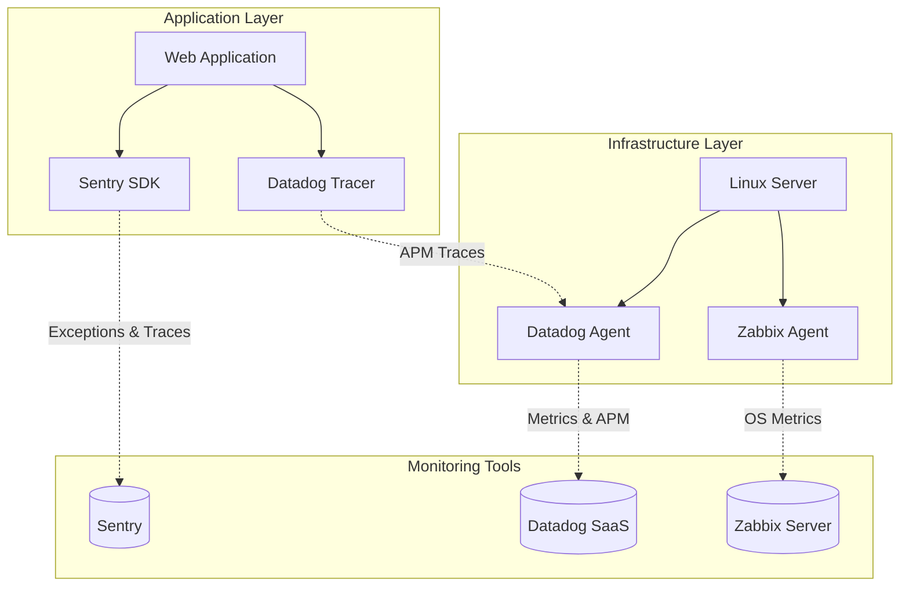

# Традиционный мониторинг (Zabbix, Datadog, Sentry)

## 📖 DevOps-история: Боль и Решение

**Боль:** Пользователи жалуются на неработающий сервис. Ops смотрят на дашборды: "Странно, загрузка CPU в норме, память есть. У нас всё работает!". Разработчики пытаются найти ошибку в логах, но они размазаны по десяткам серверов. В итоге, о падении узнают из Twitter, а не от систем мониторинга.

**Решение:** Разделение уровней наблюдения. Использование инструментов для конкретных задач: 
* **Zabbix** — для надежного инфраструктурного мониторинга (железо, сеть, демоны).
* **Datadog** — как комплексное SaaS-решение для APM, метрик и интеграций.
* **Sentry** — для трекинга исключений в коде с контекстом (стектрейсы, локальные переменные).

## 📊 Архитектура (Mermaid)



## 💻 Примеры

**1. Интеграция Sentry в Python-приложении:**
```python
import sentry_sdk

sentry_sdk.init(
    dsn="https://examplePublicKey@o0.ingest.sentry.io/0",
    traces_sample_rate=1.0, # Для профилирования производительности
    environment="production"
)

def division_by_zero():
    1 / 0 # Sentry автоматически поймает это исключение
```

**2. Запуск Datadog Agent (Docker):**
```bash
docker run -d --name dd-agent \
  -v /var/run/docker.sock:/var/run/docker.sock:ro \
  -v /proc/:/host/proc/:ro \
  -v /sys/fs/cgroup/:/host/sys/fs/cgroup:ro \
  -e DD_API_KEY="YOUR_API_KEY" \
  -e DD_SITE="datadoghq.com" \
  datadog/agent:latest
```

**3. Пример конфигурации Zabbix Item (UserParameter):**
```ini
# /etc/zabbix/zabbix_agentd.d/custom.conf
UserParameter=nginx.connections.active, curl -s http://127.0.0.1/nginx_status | grep 'Active' | awk '{print $3}'
```

## 🛠 Day 2 Operations (Советы по эксплуатации)

1. **Тюнинг алертов (Alert Tuning):** Установите окна подавления (maintenance windows) во время деплоев и бекапов. Настройте эскалацию: сначала дежурный, затем лид, если нет реакции.
2. **Context Enrichment в Sentry:** Передавайте в Sentry ID пользователя, версию релиза и теги. Это сократит время на воспроизведение бага (MTTR).
3. **Infrastructure as Code (IaC):** Настраивайте дашборды и алерты Datadog/Zabbix через Terraform. Избегайте "ClickOps".
4. **Ротация данных:** Настройте адекватные сроки хранения метрик (retention policy). Посекундные метрики не нужны для данных годовой давности.

## 🛑 Антипаттерны

* **Алерты на каждую мелочь (Alert Fatigue):** Настраивать звонок дежурному при загрузке CPU > 80% на 1 минуту. Алерты должны быть привязаны к деградации сервиса (симптоматический мониторинг).
* **Игнорирование Sentry:** Проект завален сотнями тысяч нерешенных "желтых" ошибок (warnings), за которыми не видно реальных сбоев.
* **Дефолтные пороги:** Оставлять стандартные триггеры Zabbix для баз данных, не учитывая специфику нагрузки приложения.
* **Разрозненность:** Нет связи между ошибкой в Sentry и всплеском метрик в Datadog (отсутствие сквозных trace ID).
