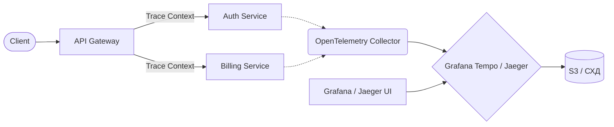

# Трейсинг (Jaeger, Grafana Tempo)

## 📖 История: Боль и Решение
**Боль:** Пользователи жалуются на медленную загрузку страницы оплаты. В микросервисной архитектуре запрос проходит через API Gateway, Auth-сервис, Billing, Inventory и БД. Логи показывают, что всё работает, но где именно теряются 5 секунд — непонятно.
**Решение:** Внедрение распределенного трейсинга. Инструменты вроде Jaeger или Grafana Tempo позволяют визуализировать путь одного запроса через все микросервисы (в виде "спанов") и мгновенно найти "бутылочное горлышко".

## 🏗 Архитектура



## 💻 Примеры

### Настройка OpenTelemetry Collector (otel-collector-config.yaml)
```yaml
receivers:
  otlp:
    protocols:
      grpc:
        endpoint: 0.0.0.0:4317
      http:
        endpoint: 0.0.0.0:4318

exporters:
  otlp/tempo:
    endpoint: "tempo:4317"
    tls:
      insecure: true

service:
  pipelines:
    traces:
      receivers: [otlp]
      exporters: [otlp/tempo]
```

### Пример кода (Python/FastAPI + OpenTelemetry)
```python
from opentelemetry import trace
from opentelemetry.instrumentation.fastapi import FastAPIInstrumentor

tracer = trace.get_tracer(__name__)

@app.get("/checkout")
async def checkout():
    with tracer.start_as_current_span("process_payment"):
        # Какая-то долгая логика
        do_heavy_work()
    return {"status": "ok"}
```

## 🛠 Day 2 Operations (Советы по эксплуатации)
- **Единый Collector:** Используйте OpenTelemetry Collector как прокси между приложениями и бэкендом трейсинга (Tempo/Jaeger). Это позволяет менять бэкенд без перенастройки всех приложений.
- **Сэмплирование (Sampling):** Не сохраняйте 100% трейсов в Production — это дорого. Настройте Tail-based sampling (сохранять все трейсы с ошибками или длительностью > 2 сек, и только 5-10% успешных).
- **Связь логов и трейсов (Exemplars):** Настройте инъекцию `trace_id` в логи. В Grafana это позволит по одному клику переходить от лога с ошибкой к полному трейсу запроса.
- **Grafana Tempo:** Если вы уже используете Loki и Prometheus, выбирайте Tempo. Он идеально интегрируется в экосистему Grafana и хранит данные в Object Storage (очень дешево).

## ⚠️ Антипаттерны
- ❌ **Слишком гранулярные спаны:** Создание спана на каждую мелкую функцию (например, форматирование строки). Это создает гигантский оверхед сети и забивает хранилище мусором.
- ❌ **Отсутствие Propagation:** Потеря `trace_id` при переходе через очереди сообщений (Kafka/RabbitMQ) или асинхронные вызовы. В итоге единый трейс разрывается на несколько независимых.
- ❌ **Хранение трейсов слишком долго:** Трейсы нужны для дебага "здесь и сейчас". Хранить их дольше 7-14 дней обычно не имеет смысла — это пустая трата места.
