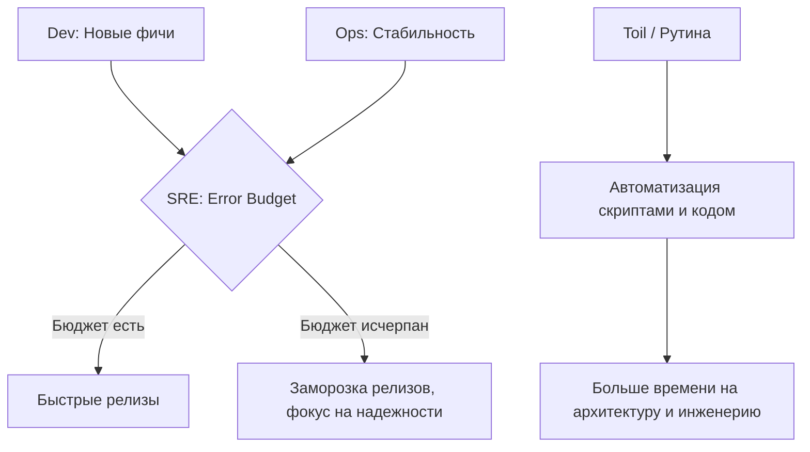

# 00 Основы SRE

## История: Боль и Решение
**Боль:** Разработчики (Dev) выкатывают фичи быстро, а сисадмины (Ops) хотят стабильности. Возникает стена непонимания, ручные релизы ломают прод, а восстановление занимает часы.
**Решение:** Site Reliability Engineering (SRE) — это подход, при котором задачи эксплуатации решаются методами программной инженерии. Инженеры пишут код для автоматизации деплоя, самовосстановления систем и прозрачного мониторинга, разрушая стену между командами.

## Архитектура подхода SRE



## Практические примеры

### Автоматизация рутины (Toil Reduction)
Простейший пример скрипта самовосстановления и уведомления (bash):
```bash
#!/bin/bash
# Проверка и перезапуск упавшего сервиса
if ! systemctl is-active --quiet nginx; then
    echo "$(date): Nginx упал. Перезапускаем..." >> /var/log/sre_auto.log
    systemctl restart nginx
    
    # Оповещение команды в Slack/Mattermost
    curl -X POST -H 'Content-type: application/json' \
      --data '{"text":"Nginx был автоматически перезапущен на сервере web-01"}' \
      $WEBHOOK_URL
fi
```

## Day 2 Operations (Советы)
- **Управляйте Toil (рутиной):** SRE-инженер должен тратить не более 50% времени на ручную работу (ответы на тикеты, деплои). Оставшиеся 50% — разработка автоматизации и улучшение архитектуры.
- **Blameless Post-Mortems:** После инцидентов обсуждайте *почему* система позволила ошибке случиться (процессы, отсутствие тестов), а не *кто* конкретно виноват.
- **Инфраструктура как код (IaC):** Любые изменения серверов и конфигураций должны проходить через Git (GitOps) и CI/CD пайплайны.

## Антипаттерны
- **SRE как "продвинутая техподдержка":** Нанимать SRE только для того, чтобы они закрывали тикеты разработчиков руками и "тушили пожары", не давая им времени на написание кода.
- **Отсутствие измеримых метрик:** Принимать решения о частоте релизов на основе эмоций или требований бизнеса, а не на математическом расчете метрик доступности (SLO).
