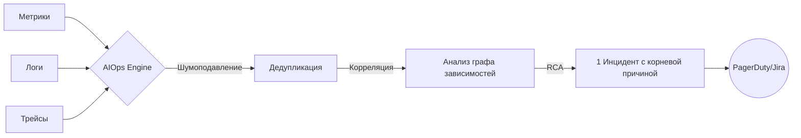

# AIOps (Artificial Intelligence for IT Operations)

## 📖 История из жизни (Боль и Решение)
**Боль:** "Шторм алертов". В Черную Пятницу упал свитч, что потянуло за собой падение БД и 50 микросервисов. Дежурный SRE получил 5000+ уведомлений в PagerDuty и Slack, не понимая, с чего начать. Alert Fatigue (усталость от алертов) в действии.
**Решение:** Внедрение AIOps-платформы (например, Datadog Watchdog, Moogsoft). ML-модель проанализировала граф зависимостей и логи, сгруппировала 5000 алертов в **один** инцидент с указанием корневой причины: "Network Switch Failure". Время реакции (MTTR) снизилось с часов до минут.

## 📊 Схема работы AIOps


## 💻 Пример: Простая ML-аномалия в Prometheus (PromQL)
Хотя полноценный AIOps требует сложных систем, базовое выявление аномалий (по алгоритму Z-Score) можно настроить средствами PromQL:

```yaml
groups:
- name: anomaly_detection
  rules:
  - alert: HighErrorRateAnomaly
    # Сравниваем текущий rate с историческим средним за неделю с учетом стандартного отклонения
    expr: >
      (
        rate(http_requests_total{status="500"}[5m]) 
        - avg_over_time(rate(http_requests_total{status="500"}[5m])[1w:5m])
      ) 
      > 3 * stddev_over_time(rate(http_requests_total{status="500"}[5m])[1w:5m])
    for: 10m
    labels:
      severity: critical
    annotations:
      summary: "Аномальный всплеск 500-х ошибок"
```

## 🛠 Day 2 Operations
- **Тюнинг ML-моделей:** AIOps требует постоянной обратной связи. Если модель сгруппировала алерты неверно, SRE должен разметить это как False Positive.
- **Гигиена данных (Garbage In = Garbage Out):** ML-алгоритмам нужны качественные, структурированные логи (JSON) и правильное тэгирование метрик.
- **Обогащение (Enrichment):** Подключайте к AIOps данные об изменениях (CI/CD деплои, изменения инфраструктуры Terraform), чтобы система могла связывать инциденты с релизами.

## ⚠️ Антипаттерны
- **Магическое мышление:** Ожидание, что AIOps починит плохую архитектуру. AI не исправит монолит без балансировщика.
- **Черный ящик (Black Box):** Слепое доверие выводам AI без возможности посмотреть "почему он так решил". Всегда нужна прозрачность логики (Explainable AI).
- **Внедрение без подготовки:** Попытка натравить AI на неструктурированную свалку текстовых логов без единого стандарта.
