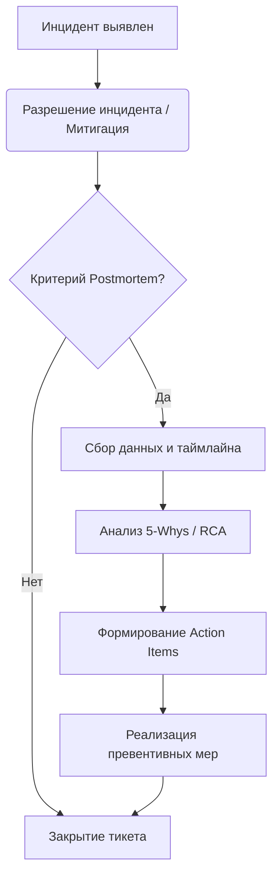

# Change и Problem Management

## DevOps-история: Боль и Решение
**Боль:** Команда регулярно деплоила изменения по пятницам. Один из таких релизов содержал опечатку в конфигурации БД, что привело к 4 часам простоя в выходные. Никто не знал, кто и зачем внес это изменение (Change Management отсутствовал), а после инцидента просто уволили инженера (отсутствие Problem Management и blameless культуры). 
**Решение:** Внедрение концепции "Инфраструктура как код" (IaC) с обязательным ревью (Change Management) и регулярное проведение Blameless Postmortems после каждого инцидента с выделением корневых причин (Root Cause Analysis).

## Процесс Problem Management



## Пример: Шаблон Postmortem (Markdown)

```markdown
# Postmortem: Ошибка подключения к БД 2026-07-25
**Статус:** Завершен
**Авторы:** @devops-team

## Что случилось (Summary)
В 14:00 сервис авторизации начал возвращать 500 ошибки из-за таймаутов БД. Downtime: 45 минут.

## Root Cause (Корневая причина)
Неправильно настроенный лимит пула соединений в обновленном конфиге PGBouncer не выдержал пиковой нагрузки.

## Action Items
1. [ ] Добавить алерт на исчерпание пула PGBouncer (Owner: @sre1)
2. [ ] Покрыть конфигурацию PGBouncer тестами CI (Owner: @devops2)
```

## Советы: Day 2 Operations
- **Blameless Culture:** Фокус на "почему система позволила человеку совершить ошибку?", а не "кто виноват?".
- **Связь проблем с бэклогом:** Action items из postmortem должны иметь высокий приоритет в спринтах разработчиков, иначе инцидент повторится.
- **GitOps для изменений:** Любые ручные изменения на проде должны расцениваться как инцидент. Все изменения — только через Git и CI/CD.

## Антипаттерны
- ❌ **"Починили и забыли":** Устранение симптома инцидента без анализа корневой причины.
- ❌ **Тяжеловесный CAB (Change Advisory Board):** Месячные согласования релиза 10 менеджерами. Замените на автоматизированные проверки и канареечные релизы.
- ❌ **Наказание за ошибки:** Ведет к сокрытию инцидентов инженерами.
