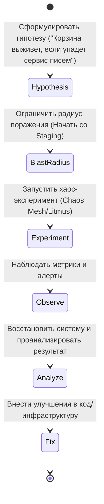

# Chaos Engineering (Chaos Mesh, Litmus, GameDays)

## 📖 История: Как мы перестали бояться падений
**Боль:** Архитектура микросервисов стала слишком сложной. Падение одного незначительного сервиса рассылки писем приводило к каскадному отказу всей корзины покупок. Инженеры боялись выходных, потому что "обязательно что-то отвалится в самом неожиданном месте".
**Решение:** Внедрение Chaos Engineering. Намеренное внесение сбоев (убийство подов, задержки в сети) в контролируемых условиях (GameDays), чтобы найти и исправить слабые места до того, как они случатся сами.

## 📊 Mermaid-схема: Процесс проведения Chaos GameDay


## 💻 Примеры (Chaos Mesh)

**YAML: Имитация задержки сети (NetworkChaos) в Kubernetes**
```yaml
apiVersion: chaos-mesh.org/v1alpha1
kind: NetworkChaos
metadata:
  name: cart-delay
  namespace: e-commerce
spec:
  action: delay
  mode: one
  selector:
    labelSelectors:
      app: cart-service
  delay:
    latency: '500ms'
    correlation: '100'
    jitter: '0ms'
  duration: '30s'
```

**Установка Chaos Mesh через Helm:**
```bash
helm repo add chaos-mesh https://charts.chaos-mesh.org
helm install chaos-mesh chaos-mesh/chaos-mesh -n chaos-mesh --create-namespace
```

## 🛠 Советы Day 2 Operations
- **Начинайте с GameDays:** Проводите хаос-эксперименты вручную всей командой. Это отличный способ обучить дежурных (On-call) и проверить документацию (Runbooks).
- **Постепенно увеличивайте радиус:** Staging -> Один под в Prod -> Целый регион в Prod.
- **Автоматический откат:** Инструменты вроде Chaos Mesh и Litmus позволяют настроить автоматическую отмену эксперимента, если метрики (например, успешные покупки) упали ниже критического уровня.

## 🚫 Антипаттерны
- **Хаос ради хаоса:** Случайное убийство серверов без гипотезы и мониторинга. Это не Chaos Engineering, это просто вандализм.
- **Проведение тестов при нестабильной системе:** Если у вас уже каждый день инциденты и система нестабильна, сначала наведите порядок базовыми методами (мониторинг, CI/CD, рефакторинг).
- **Скрытие результатов:** Неудачи в хаос-тестах — это успех эксперимента. Замалчивать их нельзя, нужно превращать их в таски на доработку отказоустойчивости.
