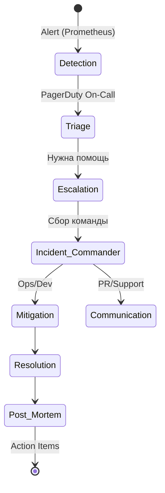

# Incident Management (Commander, Escalation, On-Call)

## DevOps История
**Боль:** Пятница вечер, падает база данных. В Slack-чате хаос: инженеры перекидывают ответственность, никто не знает, кто сейчас дежурит, клиенты жалуются в саппорт, а тимлид пытается понять, что вообще происходит. Время восстановления (MTTR) затягивается на часы из-за отсутствия координации.
**Решение:** Внедрение процесса Incident Management с четкими ролями. Назначение Incident Commander (IC), который руководит процессом, использование PagerDuty для On-Call ротаций и эскалации. Теперь каждый знает свою роль, инциденты решаются структурно, а после — пишется Blameless Post-mortem.

## Архитектура процесса (Mermaid)


## Примеры реализации

### PagerDuty Terraform (Пример On-Call Schedule)
```hcl
resource "pagerduty_schedule" "db_oncall" {
  name      = "Database On-Call"
  time_zone = "Europe/Moscow"
  layer {
    name                         = "Weekly Rotation"
    start                        = "2026-08-01T00:00:00Z"
    rotation_virtual_start       = "2026-08-01T00:00:00Z"
    rotation_turn_length_seconds = 604800 # 1 неделя
    users                        = [pagerduty_user.engineer1.id, pagerduty_user.engineer2.id]
  }
}

resource "pagerduty_escalation_policy" "db_escalation" {
  name      = "DB Escalation Policy"
  num_loops = 2
  rule {
    escalation_delay_in_minutes = 15
    target {
      type = "schedule_reference"
      id   = pagerduty_schedule.db_oncall.id
    }
  }
  rule {
    escalation_delay_in_minutes = 15
    target {
      type = "user_reference"
      id   = pagerduty_user.team_lead.id
    }
  }
}
```

## Day 2 Operations
- **Blameless Culture:** Фокусируйтесь на том, *почему* система позволила ошибке случиться, а не на том, *кто* ее совершил.
- **Game Days:** Регулярно проводите учения (chaos engineering), искусственно вызывая инциденты, чтобы тренировать команду и проверять процессы эскалации.
- **Автоматизация отчетов:** Интегрируйте ваш ITSM (Jira/ServiceNow) со Slack/PagerDuty для автоматического создания тикетов инцидентов.

## Антипаттерны
- **IC чинит сам:** Incident Commander начинает сам писать код или лезть в консоль БД вместо управления координацией.
- **Alert Fatigue:** У дежурного "замыливается" глаз из-за сотен некритичных алертов, и он пропускает настоящий P1 инцидент.
- **Бесконечная эскалация:** Политики эскалации не имеют конечного звена, и инцидент может "повиснуть", если никто не ответил.
