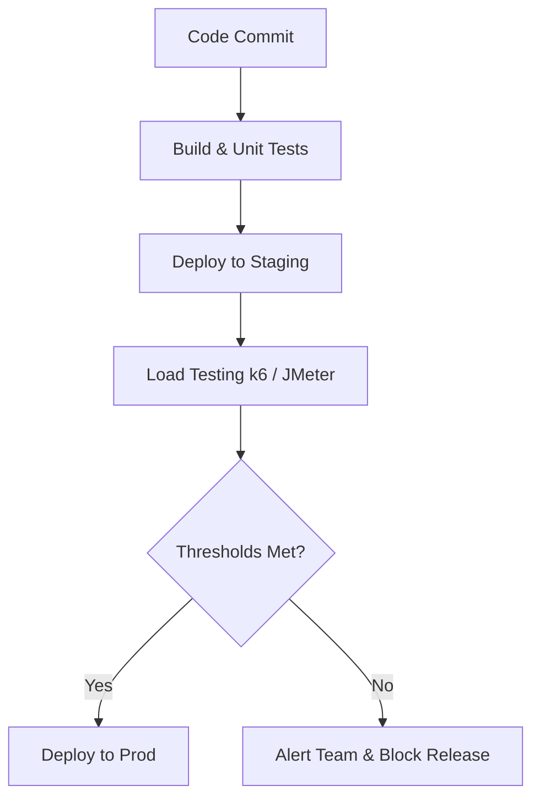

# Performance, Load, and Stress Testing

## 📖 История: От "Всё упало в Черную Пятницу" к уверенности в проде
**Боль:** Команда запускала новую фичу, тестировала её вручную. В день релиза пришло в 10 раз больше пользователей, база данных легла под количеством коннектов, посыпались 502 ошибки. 
**Решение:** Внедрение регулярных нагрузочных тестов (Load Testing) в CI/CD пайплайн для поиска бутылочных горлышек до выхода в прод и стресс-тестов (Stress Testing) для понимания пределов системы.

## 📊 Mermaid-схема: Место тестирования производительности в пайплайне


## 💻 Примеры (k6.io)

**Простой скрипт k6 (load-test.js):**
```javascript
import http from 'k6/http';
import { check, sleep } from 'k6';

export const options = {
  stages: [
    { duration: '30s', target: 20 }, // разгон до 20 пользователей
    { duration: '1m', target: 20 },  // плато
    { duration: '30s', target: 0 },  // снижение
  ],
  thresholds: {
    http_req_duration: ['p(95)<500'], // 95% запросов должны быть быстрее 500мс
  },
};

export default function () {
  const res = http.get('https://staging-api.example.com/health');
  check(res, { 'status is 200': (r) => r.status === 200 });
  sleep(1);
}
```

**Bash запуск k6:**
```bash
k6 run load-test.js
```

## 🛠 Советы Day 2 Operations
- **Тестируйте как можно ближе к проду:** Staging должен быть максимально похож на production по ресурсам, иначе результаты будут нерелевантными.
- **Интеграция с мониторингом:** Во время тестов смотрите на метрики (Prometheus, Grafana, APM), а не только на отчет инструмента тестирования.
- **Data seeding:** Подготовьте реалистичный объем данных в БД перед тестом. Тестирование на пустой базе скроет проблемы с индексами.

## 🚫 Антипаттерны
- **DDoS собственного прода:** Запуск агрессивных стресс-тестов на production среде в рабочие часы без предупреждения.
- **Игнорирование зависимостей:** Тестирование сервиса без мокирования или учета пропускной способности сторонних API.
- **Фокус только на RPS:** Важно измерять не только количество запросов в секунду (RPS), но и Latency (задержку) и Error Rate.
