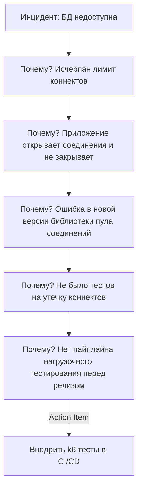

# Postmortem (Blameless, Root Cause Analysis)

## 📖 История из жизни (Боль и Решение)
**Боль:** После падения прода из-за случайного `DROP TABLE`, инженер скрыл ошибку из страха увольнения. Восстановление заняло 12 часов вместо 1 часа.
**Решение:** Внедрение культуры Blameless Postmortems и методики Root Cause Analysis (RCA). Теперь фокус смещен с "кто виноват" на "почему система позволила это сделать" (отсутствие бэкапов, отсутствие прав). Ошибки стали восприниматься как бесплатные уроки для системы.

## 📊 RCA Процесс (5 Whys)


## 💻 Пример: Шаблон Postmortem (Markdown)
```markdown
# Инцидент: Падение биллинга 2026-07-25
**Статус:** Resolved | **Severity:** SEV-1

## Summary
Из-за утечки памяти в кэше биллинг был недоступен 45 минут. Затронуто 15% пользователей.

## Timeline
- 10:00 - Срабатывание алерта (High Memory Usage).
- 10:15 - Инженер X начал расследование.
- 10:35 - Принято решение откатить релиз.
- 10:45 - Сервис восстановлен.

## Root Cause (5 Whys)
...
## Action Items
- [ ] Настроить OOM-killer (Owner: @devops)
- [ ] Добавить лимиты памяти в Helm chart (Owner: @sre)
```

## 🛠 Day 2 Operations
- **Регулярный ревью:** Проводите еженедельные встречи для разбора постмортемов (Incident Review).
- **Трекинг задач:** Postmortem не закончен, пока все Action Items не закрыты или не переведены в бэклог с нужным приоритетом.
- **Публичность:** Храните постмортемы в единой открытой базе знаний (Confluence/Notion/Obsidian).

## ⚠️ Антипаттерны
- **"Человеческий фактор":** Указывать причиной ошибку человека. Люди ошибаются, система должна быть устойчивой к ошибкам.
- **Охота на ведьм (Witch-hunt):** Поиск виноватых и наказание вместо исправления процессов.
- **Postmortem ради галочки:** Написание отчета, который никто не читает, и игнорирование Action Items.
