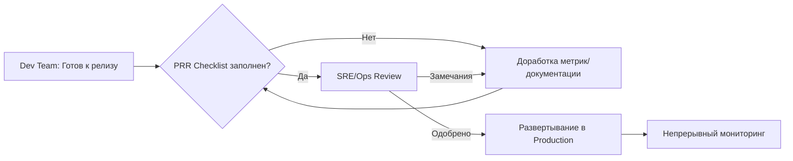

# Production Readiness Review (PRR)

## 📖 DevOps-история: Боль и решение
**Боль:** Разработчики релизнули новый микросервис в продакшен в пятницу. Сервис не имел настроенных лимитов памяти, метрик и runbook'ов. В субботу он упал из-за OOM (Out Of Memory), утащив за собой соседние поды. Дежурный инженер потратил 4 часа на выяснение архитектуры и перезапуск.
**Решение:** Внедрение процесса Production Readiness Review (PRR) — чеклиста и ревью перед выходом в бой. Теперь ни один сервис не идет в прод без метрик, алертов, квот, документации и настроенного CI/CD. Инциденты из-за плохой конфигурации практически исчезли.

## 📊 Архитектура / Схема (Mermaid)


## 💻 Примеры (YAML / Bash / Код)

### Обязательные требования PRR: Resource Limits
Каждый сервис должен иметь `requests` и `limits`, чтобы не нарушать работу соседей по ноде:
```yaml
apiVersion: apps/v1
kind: Deployment
metadata:
  name: payment-service
spec:
  template:
    spec:
      containers:
      - name: payment-app
        image: myrepo/payment:v1.2.0
        resources:
          requests:
            memory: "256Mi"
            cpu: "200m"
          limits:
            memory: "512Mi" # Защита от OOM, влияющего на ноду
            cpu: "500m"
```

### Обязательные требования PRR: Readiness/Liveness Probes
Сервис должен уметь сообщать о своем состоянии балансировщику:
```yaml
        readinessProbe:
          httpGet:
            path: /health/ready
            port: 8080
          initialDelaySeconds: 5
          periodSeconds: 10
        livenessProbe:
          httpGet:
            path: /health/live
            port: 8080
          initialDelaySeconds: 15
          periodSeconds: 20
```

## 🚀 Советы: Day 2 Operations

1. **Автоматизируйте PRR:** Используйте инструменты вроде OPA Gatekeeper или Kyverno в Kubernetes, чтобы автоматически блокировать деплой манифестов без лимитов, health check'ов и обязательных лейблов.
2. **Живой Runbook:** Документация должна быть рядом с кодом. Если алерт срабатывает, в сообщении должна быть ссылка на конкретный пункт Runbook.
3. **Уровни строгости PRR:** Разделяйте требования. Для Tier-1 (критичных) сервисов PRR должен быть строгим (SLO, распределенный трейсинг). Для внутренних утилит Tier-3 — упрощенным.
4. **Обновляйте чеклист:** После каждого Post-Mortem добавляйте новый пункт в PRR, чтобы предотвратить повторение инцидента.

## ⚠️ Антипаттерны

- **Бюрократия:** Превращение PRR в 100-страничный документ, который заполняется "для галочки" и блокирует Time-to-Market.
- **Внедрение задним числом:** Попытка заставить legacy-систему, работающую 10 лет, пройти современный строгий PRR за одну неделю.
- **Отсутствие Ownership:** Разработчики считают, что после прохождения PRR ответственность за сервис полностью переходит на SRE.
- **Игнорирование Security:** Проверка только производительности и надежности, забывая про сканирование уязвимостей, управление секретами и сетевые политики.
