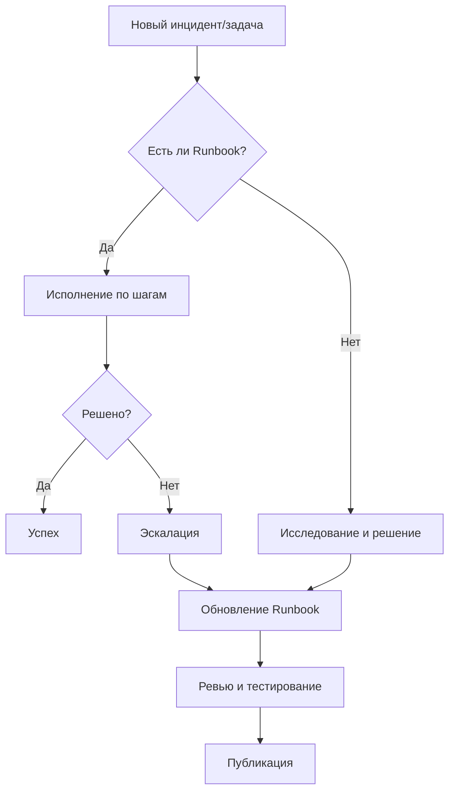

# Runbooks и Playbooks

## DevOps История
**Боль:** При падении Redis в production только один сеньор-инженер знал магическую последовательность команд для восстановления кластера. Когда он ушел в отпуск, сервис лежал 4 часа, пока джуниоры пытались найти решение в разрозненных обрывках документации в Confluence и личных заметках.
**Решение:** Внедрение "живых" Runbook-ов как кода. Все стандартные процедуры (восстановление, масштабирование, очистка диска) были задокументированы в виде пошаговых Playbook-ов (Ansible) или Jupyter-подобных тетрадей, где команды выполняются в один клик.

## Жизненный цикл Runbook (Mermaid)


## Примеры реализации

### Пример Ansible Playbook (Очистка места на диске)
```yaml
---
- name: Emergency Disk Cleanup Playbook
  hosts: web_servers
  become: yes
  tasks:
    - name: Check disk space
      command: df -h /
      register: disk_space
    
    - name: Display disk space before
      debug:
        msg: "{{ disk_space.stdout_lines }}"

    - name: Clean apt cache
      apt:
        clean: yes

    - name: Rotate and compress old logs
      shell: find /var/log -type f -name "*.log" -mtime +7 -exec gzip {} \;
      
    - name: Remove old Docker containers and images
      command: docker system prune -af
      ignore_errors: yes

    - name: Check disk space after
      command: df -h /
      register: disk_space_after

    - name: Display disk space after
      debug:
        msg: "{{ disk_space_after.stdout_lines }}"
```

## Day 2 Operations
- **Executable Runbooks:** Старайтесь делать Runbook-и исполняемыми (например, через Rundeck, AWX/Tower или GitHub Actions), чтобы минимизировать ручной копипаст команд.
- **Регулярное тестирование:** Runbook, который не запускался полгода — мертв. Настройте расписание для автоматической валидации скриптов в staging-среде.
- **Интеграция с алертами:** В каждом описании алерта в Prometheus/Grafana должна быть прямая ссылка на соответствующий Runbook.

## Антипаттерны
- **Устаревание:** Хранение Runbook-ов в виде статичных PDF или wiki-страниц, которые никто не обновляет при изменении инфраструктуры.
- **Избыток текста:** Runbook выглядит как война и мир. Во время инцидента нет времени читать долгую теорию — нужны четкие команды и проверки.
- **Hardcode:** Зашивание в скрипты конкретных IP-адресов, паролей или токенов. Используйте переменные окружения и системы управления секретами (Vault).
