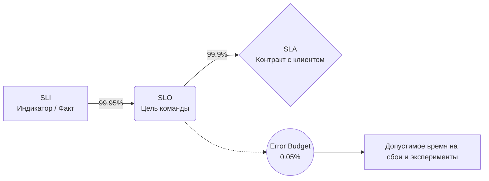

# SLI, SLO, SLA и Error Budget

## История: Боль и Решение
**Боль:** Клиенты жалуются, что "всё тормозит и отваливается", но графики CPU/RAM на серверах в норме. Команды спорят: Dev хотят делать новые фичи, а Ops требуют остановить релизы из-за багов. Нет объективного критерия для принятия решений.
**Решение:** Внедрение метрик, основанных на пользовательском опыте (SLI/SLO), и концепции бюджета на ошибки (Error Budget). Это позволяет математически обосновать баланс между скоростью инноваций и стабильностью системы.

## Связь понятий



- **SLI (Service Level Indicator):** Факт. Что именно мы измеряем (например, % успешных HTTP 200 запросов).
- **SLO (Service Level Objective):** Цель. Внутренний таргет команды (например, SLI должен быть 99.9% в месяц).
- **SLA (Service Level Agreement):** Контракт. Бизнес-обязательство перед клиентами с финансовыми штрафами (если будет ниже 99.0%, вернем деньги).
- **Error Budget (Бюджет на ошибки):** $100\% - SLO$. Если SLO 99.9%, то у нас есть 0.1% права на ошибку (около 43 минут даунтайма в месяц).

## Практические примеры

### Prometheus Rule (Alerting по Error Budget Burn Rate)
Пример конфигурации Prometheus для уведомления о слишком быстром расходовании бюджета ошибок (YAML):

```yaml
groups:
- name: sre_error_budget
  rules:
  - alert: HighErrorBudgetBurnRate
    expr: |
      (
        sum(rate(http_requests_total{status=~"5.."}[5m]))
        /
        sum(rate(http_requests_total[5m]))
      ) > (1 - 0.999) * 14.4
    for: 5m
    labels:
      severity: critical
    annotations:
      summary: "Ахтунг! Слишком быстро тратится Error Budget (SLO 99.9%)"
      description: "Процент ошибок за последние 5 минут превышает допустимый порог."
```

## Day 2 Operations (Советы)
- **Error Budget как рычаг управления:** Если бюджет полон — смело катите новые релизы и проводите хаос-инжиниринг. Если бюджет исчерпан — релизы фичей замораживаются, команда берет в спринт только задачи по улучшению надежности (технический долг).
- **Метрики от лица клиента:** SLI должны отражать опыт пользователя. Не измеряйте просто загрузку процессора. Измеряйте Latency (задержку ответов) и Error Rate (процент ответов с ошибкой).

## Антипаттерны
- **Стремление к SLO 100%:** Попытка сделать систему с идеальной доступностью. Это экспоненциально дорого, замедляет Time-to-Market до нуля и всё равно недостижимо (ломаются даже магистральные провайдеры).
- **SLO ради графиков:** Когда SLO настроены на дашбордах, но при исчерпании Error Budget никто не останавливает релизы и процессы никак не меняются.
- **Скрытие SLA от инженеров:** Когда контракты (SLA) подписывает бизнес, а инженеры не знают об этих обязательствах и настраивают алерты вслепую.
