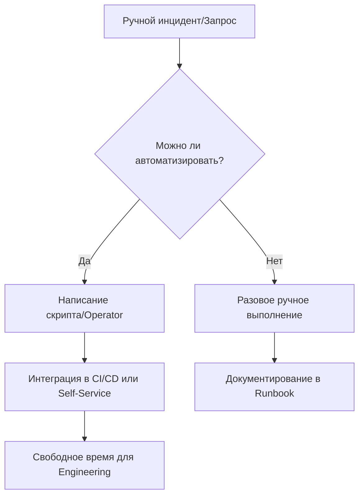

# Устранение Toil (рутины)

## 📖 DevOps-история: Боль и решение
**Боль:** Команда SRE тратила 60% времени на сброс паролей, перезапуск зависших подов и ручное масштабирование кластера при всплесках нагрузки. Люди выгорали, а времени на улучшение инфраструктуры не оставалось.
**Решение:** Внедрение принципов устранения Toil (рутины). Мы автоматизировали рутинные задачи через операторы Kubernetes, настроили автоскейлинг (HPA/VPA) и делегировали сброс доступов через self-service портал (Backstage). Toil снизился до целевых 30%.

## 📊 Архитектура / Схема (Mermaid)


## 💻 Примеры (YAML / Bash / Код)

### Автоматизация рутины: Очистка старых логов (CronJob в Kubernetes)
Вместо ручной очистки дисков, используем автоматизацию:
```yaml
apiVersion: batch/v1
kind: CronJob
metadata:
  name: cleanup-old-logs
spec:
  schedule: "0 2 * * *" # Каждую ночь в 2:00
  jobTemplate:
    spec:
      template:
        spec:
          containers:
          - name: cleanup
            image: alpine:latest
            command:
            - /bin/sh
            - -c
            - "find /var/logs/app -type f -mtime +7 -delete"
            volumeMounts:
            - name: logs-volume
              mountPath: /var/logs/app
          volumes:
          - name: logs-volume
            hostPath:
              path: /var/log/my-app
          restartPolicy: OnFailure
```

### Автоматическое масштабирование (HPA)
Устранение ручного добавления подов:
```yaml
apiVersion: autoscaling/v2
kind: HorizontalPodAutoscaler
metadata:
  name: web-app-hpa
spec:
  scaleTargetRef:
    apiVersion: apps/v1
    kind: Deployment
    name: web-app
  minReplicas: 2
  maxReplicas: 10
  metrics:
  - type: Resource
    resource:
      name: cpu
      target:
        type: Utilization
        averageUtilization: 70
```

## 🚀 Советы: Day 2 Operations

1. **Измеряйте Toil:** Введите метрику времени, затрачиваемого на рутину. SRE рекомендует держать ее ниже 50% (в идеале 30%).
2. **Self-Service:** Создавайте инструменты самообслуживания для разработчиков, чтобы они не отвлекали Ops-команду на тривиальные задачи (например, создание БД или выдача прав).
3. **Автоматизируйте безопасное восстановление:** Скрипты должны быть идемпотентными и уметь корректно обрабатывать ошибки.
4. **Не автоматизируйте хаос:** Сначала оптимизируйте и стандартизируйте процесс, только потом пишите автоматизацию.

## ⚠️ Антипаттерны

- **Скрипты "на коленке" (Shadow IT):** Написание Bash-скриптов, которые лежат только на ноутбуке одного инженера и не хранятся в Git.
- **Героизм вместо системности:** Поощрение инженеров, которые готовы вручную тушить пожары по ночам, вместо поощрения тех, кто навсегда устраняет причину этих пожаров.
- **Автоматизация ради автоматизации:** Попытка автоматизировать редкую задачу (раз в год), на автоматизацию которой уйдет месяц. (Помните про [xkcd: Is It Worth the Time?](https://xkcd.com/1205/))
- **Отсутствие алертов на автоматизацию:** Если автоматический скрипт упал, никто об этом не узнал, пока не закончилось место на диске.
