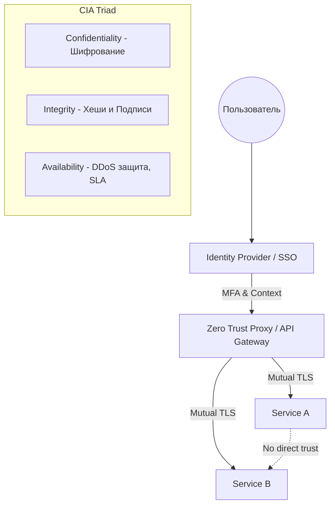

# Основы DevSecOps: CIA Triad, Threat Modeling, Zero Trust

## 📖 DevOps-история: Боль и Решение
**Боль:** Стартап разрабатывал микросервисы со скоростью света. Вся безопасность сводилась к VPN (подход "замок и ров"). Однажды утекший токен разработчика позволил злоумышленнику зайти через VPN и скомпрометировать всю базу данных, так как внутри сети все сервисы доверяли друг другу по умолчанию.
**Решение:** Внедрение концепции **Zero Trust** (никому не доверяй, всегда проверяй) и использование **Threat Modeling** на этапе проектирования (Shift-Left). В результате безопасность стала частью пайплайна, а не препятствием перед релизом, а компрометация одной точки перестала означать падение всей инфраструктуры.

## 🏗 Схема: Архитектура Zero Trust и CIA Triad


## 💻 Примеры

### Базовый профиль Threat Modeling (STRIDE)
```yaml
component: API Gateway
threats:
  - type: Spoofing
    description: "Подделка JWT токена"
    mitigation: "Использование строгой валидации подписи (RS256) и короткого срока жизни (TTL 15m)"
  - type: Elevation of Privilege
    description: "Обход проверки прав доступа к админ-эндпоинтам"
    mitigation: "Проверка RBAC на уровне API Gateway перед роутингом"
```

## 🛠 Day 2 Operations (Советы)
*   **Живой Threat Model:** Обновляйте модель угроз при каждом значительном архитектурном изменении, а не раз в год.
*   **Автоматизация проверок:** Встройте проверку безопасности в CI/CD (SAST/DAST/SCA), чтобы разработчики получали фидбек немедленно.
*   **Инкапсуляция секретов:** Используйте Vault или аналоги, обеспечьте автоматическую ротацию секретов и сертификатов для mTLS.

## 🚨 Антипаттерны
*   **"Castle and Moat" (Замок и ров):** Сильная защита периметра, но нулевая защита внутри сети.
*   **Security as an Afterthought:** Подключение безопасников только перед релизом (приводит к блокировке релизов и конфликтам).
*   **Безопасность через неясность (Security through obscurity):** Надежда на то, что хакеры "не найдут" скрытый эндпоинт, открытый порт или захардкоженный пароль.
