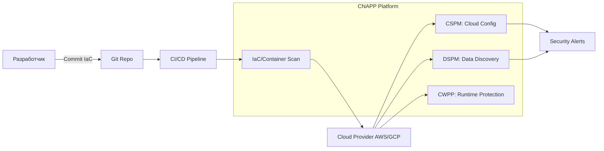

# Cloud Security (CNAPP, CSPM, DSPM)

## 📖 История: Боль и Решение
**Боль:** При миграции в облако команды начали разворачивать инфраструктуру через Terraform. Ошибки в конфигурации привели к тому, что S3 бакет с бэкапами базы данных оказался публично доступен. Узнали об этом случайно от ИБ-исследователя (в лучшем случае).
**Решение:** Внедрение **CSPM** (Cloud Security Posture Management) для сканирования облака и **CNAPP** (Cloud-Native Application Protection Platform) для комплексной защиты от кода до рантайма. Позже добавили **DSPM** (Data Security Posture Management), чтобы автоматически находить PII-данные (персональные данные) в забытых бакетах и базах.

## 📊 Архитектура (Mermaid)


## 💻 Примеры (Bash/YAML)

**1. Проверка IaC-кода (Terraform) с помощью Checkov (CSPM shift-left)**
```bash
# Установка и запуск Checkov локально или в пайплайне
pip install checkov
checkov -d ./terraform-dir/

# Вывод покажет ошибки, например:
# Check: CKV_AWS_20: "S3 bucket should not be public"
# FAILED for resource: aws_s3_bucket.data_bucket
```

**2. Интеграция Trivy в GitLab CI (Поиск мисконфигураций и секретов)**
```yaml
trivy_scan:
  stage: test
  image: aquasec/trivy:latest
  script:
    # Сканирование Terraform кода
    - trivy config ./terraform
    # Поиск секретов в репозитории
    - trivy fs --security-checks secret .
  allow_failure: false
```

## 🛠 Day 2 Operations
- **Управление алертами (Alert Fatigue):** Настройте приоритеты. Исправляйте сначала критические уязвимости, которые доступны извне (internet-facing) или связаны с реальными данными, а не просто всё подряд.
- **Автоматическая ремедиация:** Настройте Cloud Functions / Lambda для автоматического закрытия публичных портов или бакетов при обнаружении (с осторожностью для Prod, чтобы не сломать бизнес-логику).
- **Исключения (Exceptions):** Внедрите прозрачный процесс принятия рисков (Risk Acceptance) через pull-request'ы в файлы вроде `.trivyignore` или `checkov.yaml`.

## 🚫 Антипаттерны
- ❌ **Включение всех политик сразу** при первом внедрении CSPM (сотни тысяч алертов демотивируют команду, все начнут их игнорировать).
- ❌ **Сканирование только в рантайме** (исправлять ошибку в уже работающем облаке дороже и опаснее, чем в Terraform-коде — практикуйте Shift-Left).
- ❌ **Игнорирование DSPM:** Защищать инфраструктуру, не понимая, где лежат критичные данные — бессмысленно. Сначала найдите корону, потом стройте замок.
