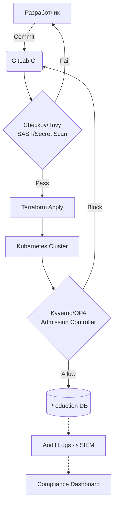

# Compliance (GDPR, PCI-DSS, SOC2, ISO 27001)

## DevOps-история (Боль и Решение)
**Боль:** Разработчики пушат секреты в репозитории, базы данных с ПДн (персональными данными) открыты всем подряд, а аудит-логи пишутся на локальные диски серверов, которые периодически удаляются. Приходит аудитор по SOC2, и компания проваливает проверку из-за отсутствия traceability (прослеживаемости) и контроля доступов.
**Решение:** Внедрение концепции "Compliance as Code". Политики безопасности описываются декларативно (OPA/Kyverno), сканирование инфраструктуры (Trivy, Checkov) встроено в CI/CD, а логи централизованно отправляются в защищенное хранилище (SIEM), недоступное для изменения.

## Архитектура и Процесс



## Примеры

**Пример политики Kyverno для запрета запуска контейнеров от root (требование SOC2/ISO 27001):**
```yaml
apiVersion: kyverno.io/v1
kind: ClusterPolicy
metadata:
  name: disallow-root-user
spec:
  validationFailureAction: enforce
  rules:
  - name: validate-runAsNonRoot
    match:
      resources:
        kinds: [Pod]
    validate:
      message: "Running as root is not allowed (Compliance Requirement)."
      pattern:
        spec:
          securityContext:
            runAsNonRoot: true
```

**Скрипт для сканирования Terraform-кода с помощью Checkov (CI/CD):**
```bash
# Запуск сканирования с привязкой к конкретному фреймворку compliance
checkov -d . --compliance SOC2 --output cli
```

## Day 2 Operations
- **Автоматизируйте сбор доказательств (Evidence Gathering):** Используйте инструменты вроде Steampipe или CloudQuery для SQL-запросов к облачной инфраструктуре, чтобы быстро генерировать отчеты для аудиторов.
- **Регулярная ротация ключей и секретов:** Настройте HashiCorp Vault или AWS Secrets Manager на автоматическую ротацию паролей к БД каждые 30/90 дней в зависимости от требований PCI-DSS.
- **Мониторинг дрейфа конфигурации (Drift Detection):** Настройте алерты, если кто-то меняет настройки (например, открывает S3 bucket миру руками в консоли) в обход Terraform.

## Антипаттерны
- **"Сделаем комплаенс перед аудитом":** Пытаться внедрить все контроли за неделю до прихода аудиторов, вместо постоянного compliance-сканирования в CI/CD пайплайнах.
- **Хранение логов аудита локально:** Размещение логов на тех же серверах, где крутится приложение. Это нарушает принцип неизменяемости (WORM) и Separation of Duties (взломали сервер — удалили логи).
- **Постоянные админские права (Standing Privileges):** Предоставление разработчикам или SRE неограниченных прав 24/7. Вместо этого следует использовать Just-In-Time (JIT) доступ с временными токенами.
