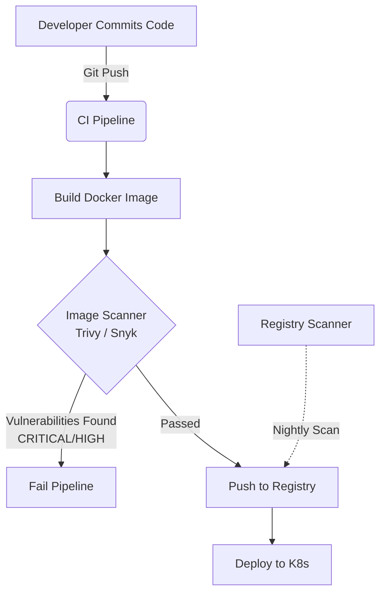

# Container Security (Trivy, Snyk)

## 📖 DevOps-история (Боль и Решение)

**Боль:** В продакшен уехал образ с критической уязвимостью в библиотеке `log4j`. Узнали об этом только после инцидента безопасности, так как образы собирались и пушились в registry без каких-либо проверок.

**Решение:** Внедрение Container Security Scanner'ов (Trivy или Snyk) на этапе CI/CD (до пуша в registry) и регулярное сканирование образов, уже находящихся в registry. Это позволяет находить уязвимости ОС и зависимостей приложения еще до деплоя.

## 🏗 Архитектура / Схема (Mermaid)



## 💻 Примеры (YAML/bash)

### Сканирование образа с помощью Trivy (bash)
```bash
# Локальное сканирование образа на критические уязвимости
trivy image --severity CRITICAL,HIGH --exit-code 1 my-app:latest
```

### Интеграция Trivy в GitLab CI (YAML)
```yaml
container_scanning:
  stage: test
  image:
    name: aquasec/trivy:latest
    entrypoint: [""]
  script:
    - trivy image --no-progress --severity CRITICAL --exit-code 1 $CI_REGISTRY_IMAGE:$CI_COMMIT_SHA
```

### Сканирование с помощью Snyk
```bash
# Авторизация и сканирование
snyk auth
snyk container test my-app:latest --severity-threshold=high
```

## 🛠 Day 2 Operations (Советы)

1.  **Vulnerability Exception Management:** Не все найденные уязвимости реально эксплуатируемы в вашем контексте (например, уязвимость в утилите `curl`, которой нет в финальном образе, или она не используется приложением). Настройте процесс принятия рисков (.trivyignore или UI Snyk).
2.  **Base Image Updates:** Регулярно обновляйте базовые образы (используйте `distroless` или `alpine`, если возможно, для уменьшения attack surface).
3.  **Continuous Scanning:** Сканируйте не только в CI, но и образы, которые уже крутятся в проде (через Trivy Operator в K8s), так как новые уязвимости (CVE) появляются каждый день.
4.  **SBOM (Software Bill of Materials):** Генерируйте и сохраняйте SBOM для каждого релиза (например, с помощью Syft или самого Trivy).

## 🚫 Антипаттерны

*   **Игнорирование базы уязвимостей:** Не обновлять базу данных CVE перед сканированием.
*   **"Ломать" пайплайн на LOW/MEDIUM:** Блокировать деплой из-за незначительных уязвимостей, что приведет к саботажу процесса сканирования разработчиками.
*   **Использование `latest` тегов:** Сканирование `latest` тега в registry не дает гарантий, что именно этот образ поедет в прод. Всегда используйте иммутабельные теги (например, commit SHA).
*   **Слепая вера сканерам:** Сканеры дают false positives. Важно анализировать результаты, а не просто смотреть на цифры.
