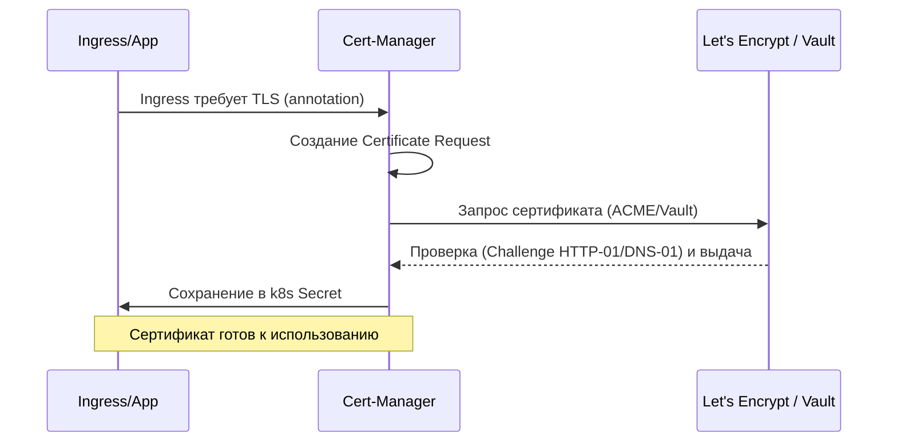

# PKI и Cert-Manager

## 📖 История: Боль и Решение
**Боль:** В компании N SSL-сертификаты обновлялись вручную. Однажды сисадмин ушел в отпуск, сертификат протух, и продакшен лег на несколько часов. Клиенты в ярости, бизнес теряет деньги, а разработчики в панике пытаются сгенерировать новые ключи.
**Решение:** Внедрение **PKI (Public Key Infrastructure)** и автоматизация через **cert-manager** в Kubernetes. Теперь сертификаты запрашиваются, валидируются, выдаются и обновляются автоматически за 30 дней до истечения срока без участия человека.

## 📊 Архитектура (Mermaid)


## 💻 Примеры (YAML/Bash)

**1. ClusterIssuer для Let's Encrypt (HTTP-01)**
```yaml
apiVersion: cert-manager.io/v1
kind: ClusterIssuer
metadata:
  name: letsencrypt-prod
spec:
  acme:
    server: https://acme-v02.api.letsencrypt.org/directory
    email: admin@example.com
    privateKeySecretRef:
      name: letsencrypt-prod-key
    solvers:
    - http01:
        ingress:
          class: nginx
```

**2. Ingress с автоматическим получением сертификата**
```yaml
apiVersion: networking.k8s.io/v1
kind: Ingress
metadata:
  name: my-app
  annotations:
    cert-manager.io/cluster-issuer: "letsencrypt-prod"
spec:
  tls:
  - hosts:
    - myapp.example.com
    secretName: myapp-tls-secret
  rules:
  - host: myapp.example.com
    http:
      paths:
      - path: /
        pathType: Prefix
        backend:
          service:
            name: my-app-svc
            port:
              number: 80
```

## 🛠 Day 2 Operations
- **Мониторинг:** Обязательно настройте алерты (через Prometheus) на метрику `certmanager_certificate_expiration_timestamp_seconds`. Даже автоматика может сломаться, нужно знать о сбоях обновления.
- **Резервное копирование:** Бэкапьте секреты ClusterIssuer и ключи корневых CA (особенно если используете самоподписанные или Vault).
- **Rate Limits:** Следите за лимитами Let's Encrypt (особенно при пересоздании кластеров). Используйте Staging среду для тестов.

## 🚫 Антипаттерны
- ❌ **Ручное редактирование TLS секретов**, созданных cert-manager (они будут перезаписаны контроллером).
- ❌ **Отсутствие мониторинга сроков действия** ("оно же автоматическое, зачем следить?").
- ❌ **Использование Prod-окружения Let's Encrypt для тестирования** инфраструктуры (быстро упретесь в лимиты).
