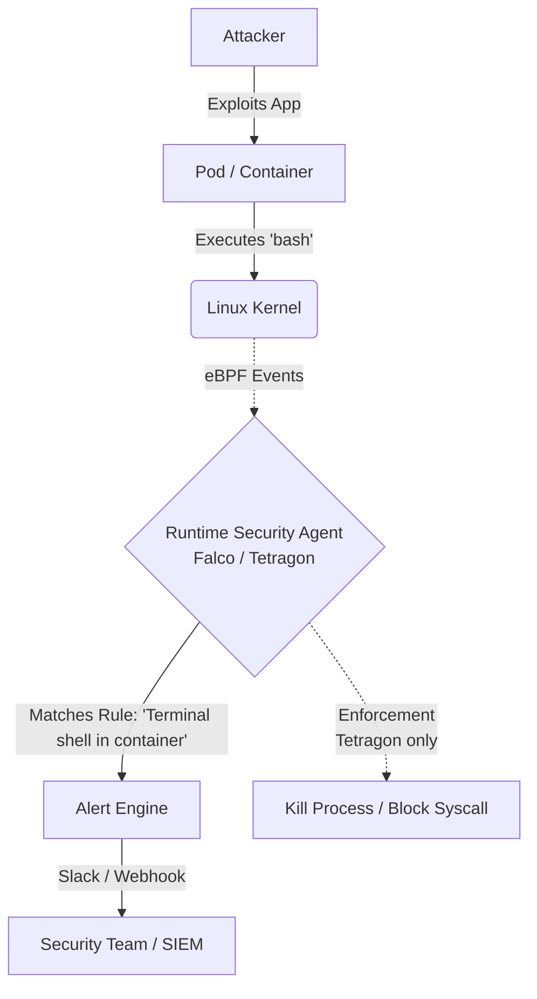

# Runtime Security (Falco, Tetragon)

## 📖 DevOps-история (Боль и Решение)

**Боль:** Контейнеры успешно прошли проверку на этапе CI, но злоумышленник нашел 0-day уязвимость в самом приложении и получил shell в поде базы данных. Он тихо скачал `nmap`, просканировал внутреннюю сеть и выгрузил данные. Никто ничего не заметил, пока логи не всплыли в даркнете.

**Решение:** Внедрение Runtime Security (Falco или Tetragon). Эти инструменты используют eBPF для мониторинга системных вызовов (syscalls) в реальном времени. Если кто-то попытается запустить `bash`, прочитать `/etc/shadow` или открыть нестандартный сетевой порт внутри контейнера, система немедленно сгенерирует алерт или заблокирует действие.

## 🏗 Архитектура / Схема (Mermaid)



## 💻 Примеры (YAML/bash)

### Установка Falco через Helm
```bash
helm repo add falcosecurity https://falcosecurity.github.io/charts
helm repo update
helm install falco falcosecurity/falco \
  --set driver.kind=ebpf \
  --set tty=true \
  --namespace falco --create-namespace
```

### Пример правила Falco (YAML)
```yaml
# Правило: Отлов запуска shell в контейнере
- rule: Terminal shell in container
  desc: A shell was used as the entrypoint/exec point into a container with an attached terminal.
  condition: >
    spawned_process and container
    and shell_procs and proc.tty != 0
    and container_entrypoint
  output: >
    A shell was spawned in a container with an attached terminal (user=%user.name user_loginuid=%user.loginuid %container.info
    shell=%proc.name parent=%proc.pname cmdline=%proc.cmdline terminal=%proc.tty container_id=%container.id image=%container.image.repository)
  priority: NOTICE
  tags: [container, shell, mitre_execution]
```

### Пример политики Tetragon (Cilium)
Tetragon может не только алертить, но и блокировать (Enforcement).
```yaml
apiVersion: cilium.io/v1alpha1
kind: TracingPolicy
metadata:
  name: "block-etc-shadow-read"
spec:
  kprobes:
  - call: "sys_openat"
    syscall: true
    args:
    - index: 1
      type: "string"
    selectors:
    - matchArgs:
      - index: 1
        operator: "Equal"
        values:
        - "/etc/shadow"
      matchActions:
      - action: Sigkill # Убить процесс при попытке чтения
```

## 🛠 Day 2 Operations (Советы)

1.  **Tuning & Exception Handling:** Будьте готовы к огромному количеству False Positives на старте (например, легитимные скрипты мониторинга или бэкапа). Настройте макросы и исключения (Exceptions) в правилах.
2.  **Performance Impact:** eBPF очень эффективен, но сложные правила или слишком широкий скоуп мониторинга могут дать overhead на CPU ядра. Мониторьте потребление ресурсов агентами.
3.  **Alert Routing:** Не отправляйте сырые алерты в общую группу Slack. Интегрируйте их с SIEM (через Falcosidekick) или Security Hub для корреляции и агрегации.
4.  **Gradual Rollout:** При использовании Enforcement (Tetragon) начинайте только с аудита (Audit mode), чтобы не поломать production. Включайте блокировку только для проверенных паттернов (например, запуск криптомайнеров).

## 🚫 Антипаттерны

*   **Деплой "из коробки" в прод:** Включение всех дефолтных правил без адаптации под ваше окружение приведет к alert fatigue (усталости от алертов).
*   **Игнорирование Host OS:** Мониторинг только контейнеров, забывая про сами ноды (Worker nodes K8s). Уязвимости на уровне ОС хоста не менее опасны.
*   **Использование Kernel Modules вместо eBPF:** Если ядро позволяет, всегда используйте eBPF. Старые kernel modules менее безопасны и стабильны.
*   **Слишком широкие исключения:** Создание исключений вида "игнорировать все действия процесса java", что полностью сводит на нет смысл runtime security для этого приложения.
