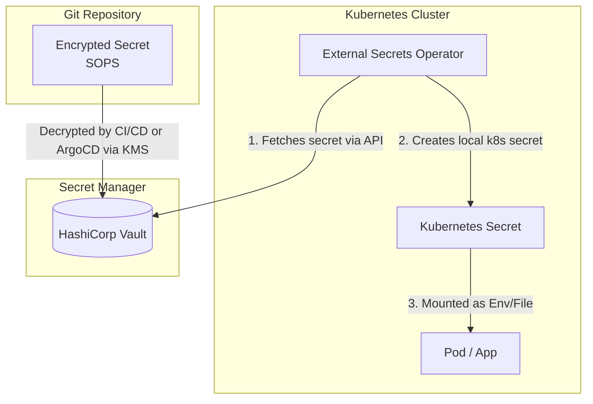

# Secrets Management: Vault, External Secrets, SOPS

## История (Боль и Решение)
**Боль:** Разработчики хардкодят пароли от БД прямо в исходном коде или хранят их в `.env` файлах, которые случайно пушатся в публичные Git-репозитории. В Kubernetes секреты лежат в base64, и любой, у кого есть доступ на чтение кластера, может их увидеть. При утечке пароля непонятно, как быстро его поменять везде, не положив прод.

**Решение:** Внедрение системы управления секретами.
Для GitOps используется **SOPS** (Secrets OPerationS) — секреты шифруются прямо в репозитории ключами из KMS.
Для централизованного хранения и динамических секретов используется **HashiCorp Vault**. В Kubernetes пароли доставляются прозрачно через **External Secrets Operator** (ESO) напрямую из Vault, исключая их появление в виде plain-text в конфигурациях.

## Архитектура (Mermaid)



## Примеры

### 1. Шифрование файла через SOPS с AWS KMS
```bash
# Создание зашифрованного файла
sops --kms arn:aws:kms:eu-central-1:1234567890:key/abc-123 config.yaml

# Редактирование секрета на лету
sops config.yaml
```

### 2. External Secrets Operator (ESO) - Manifests
Связываем Kubernetes с Vault:
```yaml
apiVersion: external-secrets.io/v1beta1
kind: SecretStore
metadata:
  name: vault-backend
spec:
  provider:
    vault:
      server: "https://vault.company.com:8200"
      path: "secret"
      version: "v2"
      auth:
        kubernetes:
          mountPath: "kubernetes"
          role: "my-app-role"
          serviceAccountRef:
            name: "default"
```

Извлекаем конкретный секрет:
```yaml
apiVersion: external-secrets.io/v1beta1
kind: ExternalSecret
metadata:
  name: db-credentials
spec:
  refreshInterval: "1h"
  secretStoreRef:
    name: vault-backend
    kind: SecretStore
  target:
    name: db-secret-k8s # Имя создаваемого k8s секрета
  data:
    - secretKey: DB_PASSWORD
      remoteRef:
        key: kv/my-app/database
        property: password
```

## Советы Day 2 Operations
- **Динамические секреты (Dynamic Secrets):** Используйте Vault для генерации временных credentials к базам данных (например, PostgreSQL). Vault сам создаст пользователя и удалит его после истечения TTL.
- **Break-glass процедуры:** Имейте четкую, протестированную инструкцию на случай недоступности Vault (распечатка unseal-ключей (shamir secret sharing), бэкапы Consul/Raft).
- **Аудит и Алертинг:** Мониторьте логи доступа (audit logs). Настройте алерты на попытки доступа к секретам с неавторизованных IP или подозрительно частое чтение секретов.

## Антипаттерны
- ❌ **Хранение секретов в переменных окружения CI/CD (GitLab CI/GitHub Actions):** Лучше пусть CI/CD запрашивает секрет из Vault по OIDC/JWT на время выполнения джобы, чем хранить секреты статично в UI системы.
- ❌ **Слишком широкие права доступа (Wildcard ACL):** Выдача приложению прав на чтение `secret/*` вместо узкого `secret/my-app/*`.
- ❌ **Комиты нешифрованных паролей:** Если пароль попал в Git — он скомпрометирован. Необходимо не просто удалить коммит (или использовать BFG Repo-Cleaner), а обязательно **сменить пароль в целевой системе**.
- ❌ **Отсутствие ротации:** Создать пароль для БД один раз на 10 лет и никогда его не менять.
