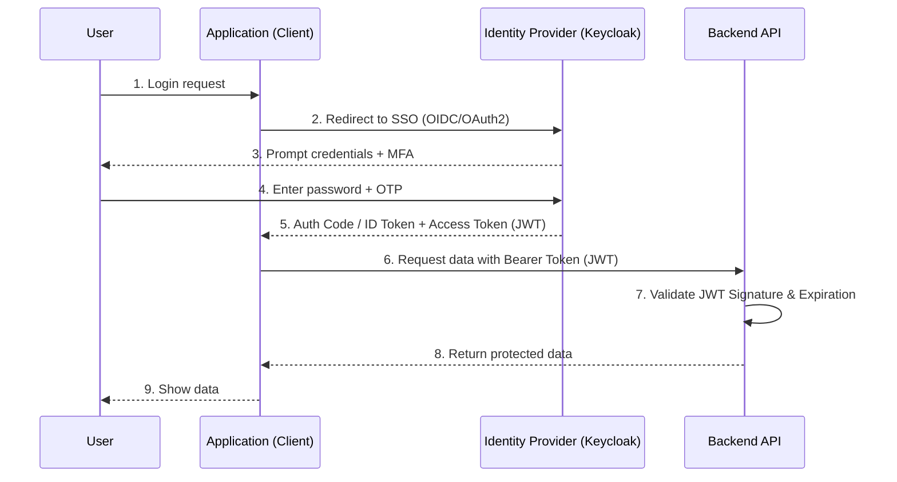

# Аутентификация: OAuth2, OIDC, JWT, SSO, MFA

## История (Боль и Решение)
**Боль:** У нас 15 микросервисов, Jenkins, GitLab, Grafana и Kibana. В каждой системе пользователи заводят отдельные пароли. Разработчики постоянно забывают доступы, служба поддержки завалена тикетами на сброс паролей. При увольнении сотрудника админам приходится вручную блокировать его в 20 местах, что порождает дыры в безопасности.

**Решение:** Внедрение Single Sign-On (SSO) с использованием OpenID Connect (OIDC) и OAuth2. Единый Identity Provider (например, Keycloak или Okta) отвечает за аутентификацию и выдает JSON Web Tokens (JWT). Пользователь логинится один раз, после чего безопасно ходит во все системы. Внешние сервисы защищены многофакторной аутентификацией (MFA).

## Архитектура (Mermaid)



## Примеры

### JWT (JSON Web Token)
JWT состоит из трех частей (Header, Payload, Signature), закодированных в Base64.
Пример полезной нагрузки (Payload):
```json
{
  "sub": "1234567890",
  "name": "Ivan DevOps",
  "groups": ["admin", "developer"],
  "iat": 1516239022,
  "exp": 1516242622
}
```

### Настройка OIDC в Grafana (grafana.ini)
```ini
[auth.generic_oauth]
enabled = true
name = Keycloak-SSO
allow_sign_up = true
client_id = grafana
client_secret = ${GRAFANA_OAUTH_CLIENT_SECRET}
scopes = openid profile email groups
auth_url = https://sso.example.com/realms/company/protocol/openid-connect/auth
token_url = https://sso.example.com/realms/company/protocol/openid-connect/token
api_url = https://sso.example.com/realms/company/protocol/openid-connect/userinfo
role_attribute_path = contains(groups[*], 'admin') && 'Admin' || contains(groups[*], 'editor') && 'Editor' || 'Viewer'
```

## Советы Day 2 Operations
- **Ротация ключей (Key Rotation):** Регулярно обновляйте ключи подписи токенов (JWKS) на стороне IdP без даунтайма.
- **Мониторинг сессий:** Отслеживайте аномалии в логах (например, логин из необычных гео-локаций). Интегрируйте логи IdP с SIEM.
- **Резервирование IdP:** Ваш сервис авторизации становится единой точкой отказа. Разворачивайте Keycloak в HA-кластере (High Availability) с внешней БД.
- **Short-lived Tokens:** Делайте время жизни Access Token (JWT) коротким (5-15 минут), а для продления сессии используйте Refresh Token.

## Антипаттерны
- ❌ **Хранение секретных данных в JWT:** JWT легко декодируется (это Base64, а не шифрование). Никогда не кладите туда пароли, токены к БД или приватные ключи.
- ❌ **Отсутствие проверки срока действия (exp):** Принимать токен, у которого истек срок годности.
- ❌ **Жесткая привязка к конкретному SSO провайдеру в коде:** Используйте стандартные библиотеки OIDC, чтобы в будущем можно было легко переехать с Keycloak на Azure AD или Okta.
- ❌ **Shared accounts (общие учетки):** Использование единого логина `admin` для всей команды.
