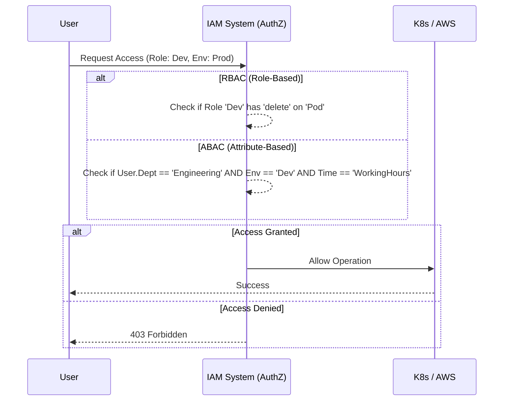

# Управление доступом: IAM, RBAC, ABAC, Least Privilege

## 📖 DevOps-история: Боль и Решение
**Боль:** В компании все инженеры имели права `cluster-admin` в Kubernetes и `AdministratorAccess` в AWS для "удобства и скорости". В пятницу вечером junior-разработчик случайно применил Terraform-скрипт не в ту среду, удалив production-базу.
**Решение:** Внедрение принципа **Least Privilege** (минимальных привилегий) через строгий **RBAC** (Role-Based Access Control). Полный доступ выдается только временно (Just-in-Time) и по аппруву, а повседневная работа идет под урезанными правами, не позволяющими вносить деструктивные изменения в прод.

## 🏗 Схема: Модель принятия решений (ABAC vs RBAC)


## 💻 Примеры

### Пример Kubernetes RBAC (Least Privilege)
Ограничиваем разработчиков только просмотром логов и подов в неймспейсе `app-prod`:
```yaml
apiVersion: rbac.authorization.k8s.io/v1
kind: Role
metadata:
  namespace: app-prod
  name: log-reader
rules:
- apiGroups: [""]
  resources: ["pods", "pods/log"]
  verbs: ["get", "list", "watch"]
---
apiVersion: rbac.authorization.k8s.io/v1
kind: RoleBinding
metadata:
  name: read-logs-binding
  namespace: app-prod
subjects:
- kind: Group
  name: developers
  apiGroup: rbac.authorization.k8s.io
roleRef:
  kind: Role
  name: log-reader
  apiGroup: rbac.authorization.k8s.io
```

## 🛠 Day 2 Operations (Советы)
*   **Регулярные аудиты доступа:** Автоматизируйте проверки (Access Reviews) раз в квартал для отзыва неактивных прав.
*   **Just-in-Time (JIT) доступ:** Используйте инструменты вроде Teleport или AWS SSO для выдачи прав администратора только на время инцидента с автоматическим отзывом по таймауту.
*   **Автоматизация Onboarding/Offboarding:** Привяжите IAM к HR-системе (например, через SCIM), чтобы уволенные сотрудники теряли доступ мгновенно и автоматически.

## 🚨 Антипаттерны
*   **Дикие карты (Wildcards `*`):** Использование `Action: "*"` или `Resource: "*"` в политиках.
*   **Долгоживущие ключи:** Раздача статических Access Keys, которые лежат на локальных машинах разработчиков годами.
*   **Общие аккаунты (Shared accounts):** Использование одной учетной записи `admin` на всю команду (невозможно отследить по Audit Logs, кто именно совершил действие).
