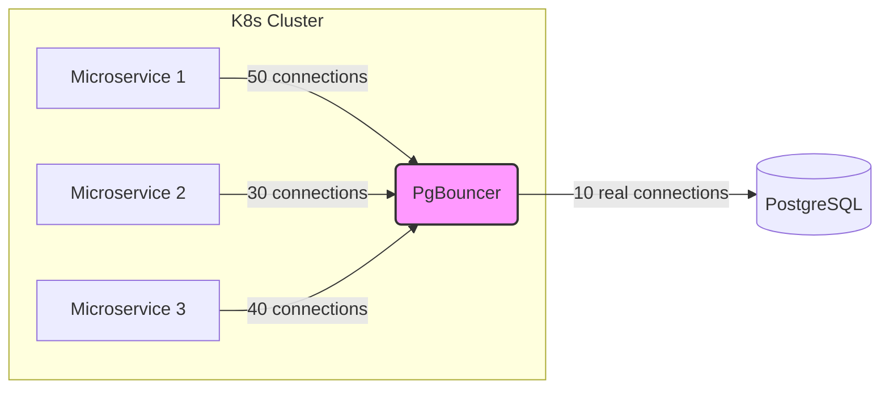

# Connection Pooling (PgBouncer)

## 📖 История боли и решения

**Боль:** Микросервисная архитектура масштабировалась, и каждый под создавал свои соединения к PostgreSQL. В пиковые нагрузки количество коннектов превысило лимит (например, 1000), БД начала потреблять всю оперативную память на поддержание соединений и стала отклонять новые запросы с ошибкой `FATAL: sorry, too many clients already`.

**Решение:** Внедрение пулера соединений. PgBouncer встал между приложением и базой данных. Приложение подключается к PgBouncer, а он переиспользует ограниченный пул реальных соединений к PostgreSQL. Память спасена, лимиты не превышаются, коннекты выдаются мгновенно.

## 🏗 Архитектура



## 🛠 Примеры (Конфигурация PgBouncer)

**pgbouncer.ini:**
```ini
[databases]
# Имя БД в пулере = строка подключения к реальной БД
mydb = host=pg-cluster.local port=5432 dbname=realdb

[pgbouncer]
listen_port = 6432
listen_addr = *
auth_type = md5
auth_file = userlist.txt

# Режим пулинга: session (по умолчанию), transaction (самый частый для микросервисов), statement
pool_mode = transaction

max_client_conn = 10000
default_pool_size = 20
```

## 🚀 Day 2 Operations

*   **Мониторинг:** Используйте экспортеры для PgBouncer (например, `pgbouncer_exporter`). Главные метрики: `client_active`, `client_waiting`, `server_active`, `server_idle`. Если `client_waiting` стабильно растет — пора увеличивать `default_pool_size` или шардировать базу.
*   **Режим пулинга:** В 99% случаев для современных stateless-приложений нужен `transaction` mode. `session` mode не спасет от большого количества коннектов, если микросервисы держат их открытыми постоянно.
*   **Очистка коннектов:** В `transaction` mode не работают Prepared Statements. Если ваш ORM (например, Hibernate или Entity Framework) агрессивно их использует, отключите их в драйвере или переключите PgBouncer в `session` mode (но тогда вы теряете главную фичу). *В новых версиях PostgreSQL и PgBouncer появилась поддержка PS на уровне транзакций, но требует аккуратной настройки.*

## ⛔ Антипаттерны

1.  **Слишком большой `default_pool_size`:** Ставить пул размером в 500 коннектов к одной БД, "чтобы всем хватило". Это убьет саму идею пулера. Обычно 20-50 соединений хватает для обслуживания тысяч клиентских запросов в `transaction` mode.
2.  **Отсутствие таймаутов на клиенте:** Если PgBouncer тормозит или БД лежит, клиенты могут бесконечно ждать коннекта, забивая очередь PgBouncer. Настраивайте `connect_timeout` в приложении.
3.  **Использование PgBouncer для тяжелых аналитических запросов:** Аналитику (OLAP) лучше пускать мимо пулера напрямую в реплику (в `session` mode или вообще без пулера), так как долгие запросы займут весь пул.
