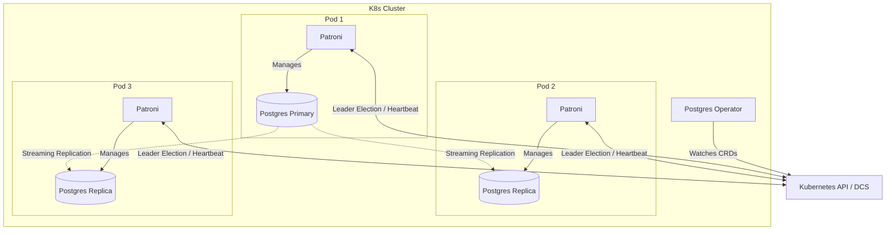

# Database Operators for K8s (Patroni, PXC)

## 📖 DevOps-история (Боль и Решение)

**Боль:** "Kubernetes отлично подходит для stateless-приложений, но как нам запустить в нем базу данных?" Запуск stateful-нагрузок (особенно RDBMS) в K8s — это кошмар. Нужно управлять репликацией, обрабатывать failover, избегать split-brain, делать бэкапы, и при этом поды эфемерны и могут быть убиты в любой момент.

**Решение:** Kubernetes Operators (Операторы). Оператор инкапсулирует знания DBA (Database Administrator) в программный код. Он использует Custom Resource Definitions (CRD) для декларативного описания кластера БД. 
- **PostgreSQL:** Используются операторы (Zalando, Crunchy Data), под капотом которых работает **Patroni** для HA и Leader Election через Distributed Configuration Store (DCS, например, Kubernetes API).
- **MySQL:** Percona XtraDB Cluster (PXC) Operator обеспечивает синхронную репликацию Galera.

## 🏗️ Архитектура (Patroni & Postgres Operator)



## 🛠️ Примеры

### Zalando Postgres Operator CRD
Минимальный манифест для создания HA PostgreSQL кластера:
```yaml
apiVersion: "acid.zalan.do/v1"
kind: postgresql
metadata:
  name: acid-minimal-cluster
  namespace: default
spec:
  teamId: "acid"
  volume:
    size: 1Gi
  numberOfInstances: 2
  users:
    zalando:  # Creates user 'zalando' with superuser privileges
    - superuser
    - createdb
  databases:
    foo: zalando  # Creates DB 'foo' owned by user 'zalando'
  postgresql:
    version: "15"
```

## ⚙️ Day 2 Operations

1. **Chaos Engineering:** Регулярно тестируйте failover. Убивайте Pod с Primary базой и убедитесь, что Patroni корректно выбирает нового лидера и перенаправляет трафик.
2. **Управление пулами соединений:** Используйте PgBouncer (часто встроен в операторы) для управления соединениями, так как Postgres плохо переносит большое количество одновременных коннектов.
3. **Резервное копирование:** Настройте непрерывное архивирование WAL-файлов (например, с помощью WAL-G) в объектное хранилище (S3) для возможности Point-in-Time Recovery (PITR).

## ⚠️ Антипаттерны

- **Эфемерное хранилище:** Использование `emptyDir` вместо PersistentVolume (PVC) со StorageClass, обеспечивающим надежность (например, Ceph, EBS).
- **Игнорирование PDB (Pod Disruption Budgets):** Если не настроить PDB, K8s может выселить слишком много узлов БД одновременно (например, при апгрейде нод), что приведет к даунтайму.
- **Запуск "вслепую":** Использование оператора без понимания того, как он работает под капотом (например, как Patroni использует K8s API для блокировок). Когда что-то сломается, вы не сможете это починить.
