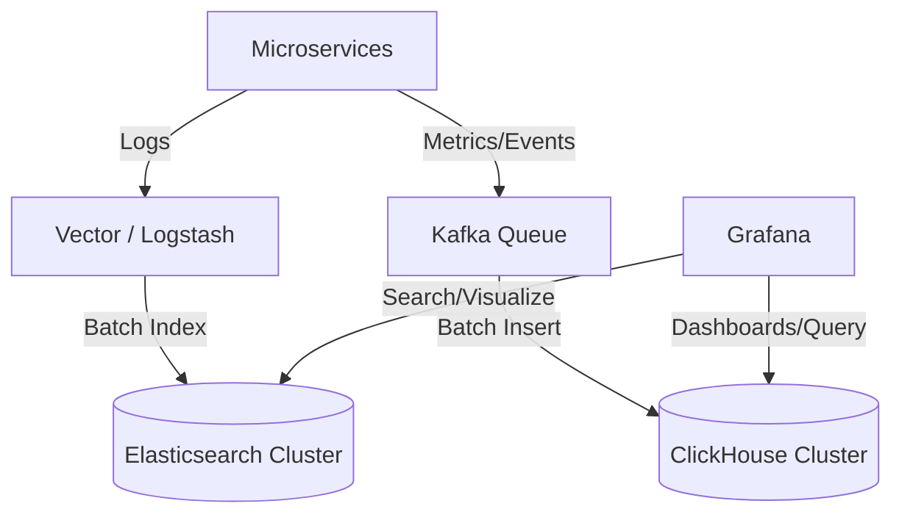

# Аналитические БД и поиск: Elasticsearch & ClickHouse

## DevOps Story
**Боль:** Хранение терабайтов логов и метрик в PostgreSQL привело к тому, что аналитические запросы для дашбордов выполнялись минутами, а полнотекстовый поиск по логам просто ложил базу, блокируя транзакции.
**Решение:** Внедрение Elasticsearch для быстрого полнотекстового поиска логов и ClickHouse для агрегации метрик и аналитики огромных объемов временных рядов (OLAP). Произошло разделение аналитической и транзакционной нагрузки.

## Архитектура


## Примеры (JSON/SQL)

### Elasticsearch ILM (Index Lifecycle Management) Policy
```json
PUT _ilm/policy/logs_policy
{
  "policy": {
    "phases": {
      "hot": {
        "actions": { "rollover": { "max_age": "1d", "max_size": "50gb" } }
      },
      "delete": {
        "min_age": "30d",
        "actions": { "delete": {} }
      }
    }
  }
}
```

### ClickHouse Table Engine (MergeTree)
```sql
CREATE TABLE default.metrics
(
    event_time DateTime,
    metric_name String,
    value Float64
)
ENGINE = MergeTree
PARTITION BY toYYYYMM(event_time)
ORDER BY (metric_name, event_time);
```

## Day 2 Operations
- **Elasticsearch:** Управляйте размером шардов (оптимально 10-50GB). Слишком много мелких шардов убивает Heap-память мастер-нод. Обязательно настройте Index Lifecycle Management (ILM) для удаления старых индексов.
- **ClickHouse:** Избегайте частых мелких вставок (INSERT). ClickHouse любит батчи (тысячи или миллионы строк за раз). Используйте интеграцию с Kafka (`Kafka Engine`) или буферные таблицы.
- **Мониторинг:** В ES следите за Garbage Collection и состоянием кластера (Green/Yellow/Red). В ClickHouse следите за количеством мутаций и background merges.

## Антипаттерны
- **Elasticsearch как источник правды:** Использование ES как первичного и единственного хранилища данных. Это поисковый движок, при сбоях возможны потери данных.
- **ClickHouse для точечных UPDATE/DELETE:** Попытки часто обновлять или удалять одиночные строки. ClickHouse — это append-only БД. Мутации (`ALTER TABLE ... UPDATE/DELETE`) очень тяжелые и выполняются асинхронно.
- **Перегрузка маппингов (ES):** Динамический маппинг может привести к взрыву количества полей (mapping explosion), если логи содержат произвольные JSON-ключи. Отключайте динамический маппинг для логов.
