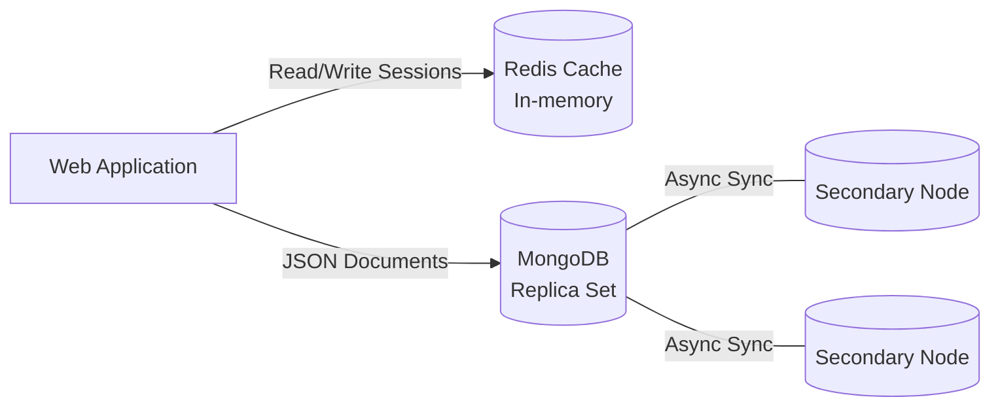

# NoSQL Databases: MongoDB & Redis

## DevOps Story
**Боль:** Монолитная реляционная БД начала задыхаться от потока неструктурированных JSON-логов и тысяч мелких сессий пользователей, что приводило к деградации производительности всего приложения и исчерпанию пула соединений.
**Решение:** Разделение ответственности. Кэш и сессии были вынесены в in-memory базу Redis, а хранение слабоструктурированных документов и логов — в документ-ориентированную MongoDB. Это разгрузило основную СУБД и снизило задержки на чтение до миллисекунд.

## Архитектура


## Примеры (YAML/bash)

### Redis Docker Compose
```yaml
version: '3.8'
services:
  redis:
    image: redis:7-alpine
    command: redis-server --requirepass securepassword --maxmemory 256mb --maxmemory-policy allkeys-lru
    ports:
      - "6379:6379"
    volumes:
      - redis_data:/data
volumes:
  redis_data:
```

### MongoDB Replica Set Init
```bash
# Инициализация Replica Set через mongosh
mongosh --host mongo1:27017 -u admin -p pass --eval '
rs.initiate({
  _id: "rs0",
  members: [
    { _id: 0, host: "mongo1:27017" },
    { _id: 1, host: "mongo2:27017" },
    { _id: 2, host: "mongo3:27017" }
  ]
})'
```

## Day 2 Operations
- **MongoDB:** Регулярно проверяйте размер Oplog (`rs.printReplicationInfo()`). Если он слишком мал, ноды не успеют синхронизироваться после падения и потребуют полного resync.
- **Redis:** Настройте алерты на `used_memory_rss` и `evicted_keys`. Всегда настраивайте `maxmemory` и политику вытеснения, иначе OOM-killer ОС убьет процесс базы данных.
- **Бэкапы:** Для MongoDB используйте копирование снапшотов дисков. Для Redis — периодические дампы RDB на S3 или AOF для большей надежности.

## Антипаттерны
- **Redis как постоянное хранилище:** Использование Redis как основной БД без понимания механизма сброса на диск (AOF/RDB) и возможной потери данных при крэше.
- **Огромные документы MongoDB:** Хранение в одном документе бесконечно растущих массивов (например, логи событий пользователя), что приводит к фрагментации и превышению лимита 16MB.
- **Отсутствие индексов:** Выполнение запросов без индексов, приводящее к полному сканированию коллекций (COLLSCAN) и падению производительности CPU.
