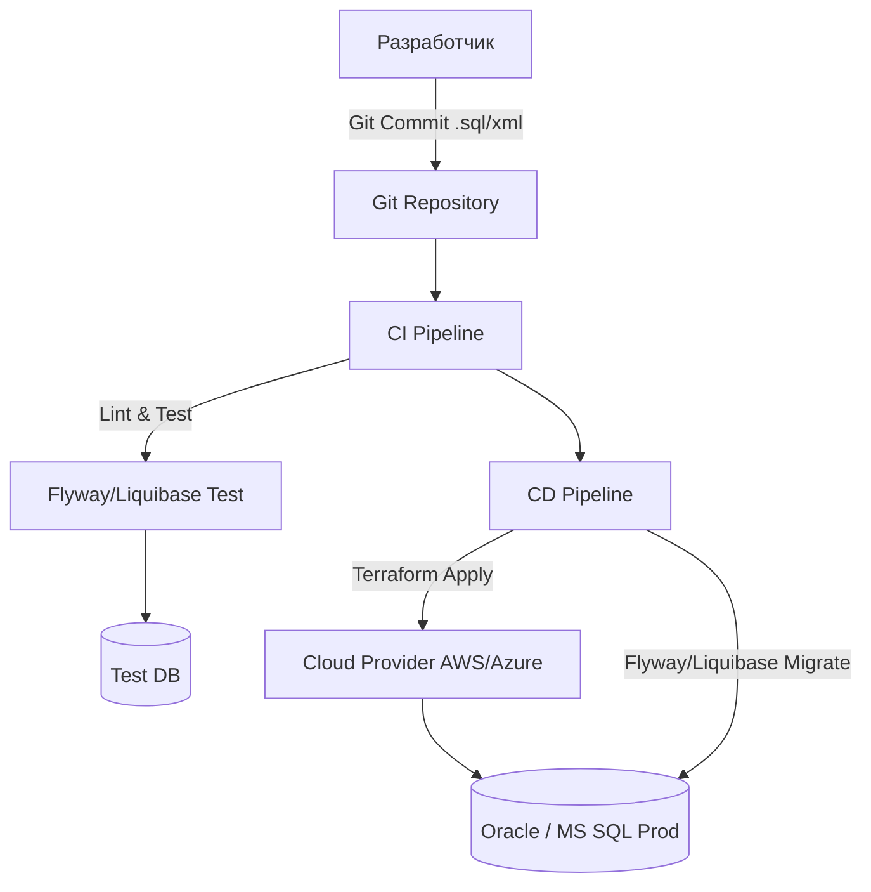

# Oracle & MS SQL Server в DevOps

## 📖 DevOps-история (Боль и Решение)

**Боль:** "Нам нужны enterprise-фичи и поддержка 24/7!" В компаниях часто исторически используются тяжеловесные монолитные СУБД (Oracle, MS SQL). Их сложно автоматизировать: ручное развертывание, сложные схемы лицензирования, зависимость от узкоспециализированных DBA. Это становится узким местом для CI/CD и Agile-команд.

**Решение:** Переход к Database-as-a-Service (DBaaS) облачным решениям (AWS RDS, Azure SQL), использование Infrastructure as Code (Terraform) для провижининга и внедрение инструментов версионирования схем БД (Liquibase, Flyway) для интеграции в CI/CD пайплайны. MS SQL Server также отлично контейнеризуется благодаря версии для Linux.

## 🏗️ Архитектура (CI/CD для Enterprise БД)



## 🛠️ Примеры

### Terraform (Azure SQL Database)
```hcl
resource "azurerm_mssql_server" "example" {
  name                         = "my-mssql-server"
  resource_group_name          = azurerm_resource_group.example.name
  location                     = azurerm_resource_group.example.location
  version                      = "12.0"
  administrator_login          = "sqladmin"
  administrator_login_password = var.db_password
}

resource "azurerm_mssql_database" "example" {
  name      = "my-database"
  server_id = azurerm_mssql_server.example.id
  sku_name  = "S1"
}
```

### Docker Compose (MS SQL Server for Linux)
Для локальной разработки:
```yaml
version: '3.8'
services:
  sqlserver:
    image: mcr.microsoft.com/mssql/server:2022-latest
    environment:
      ACCEPT_EULA: "Y"
      MSSQL_SA_PASSWORD: "YourStrong!Passw0rd"
    ports:
      - "1433:1433"
```

## ⚙️ Day 2 Operations

1. **Мониторинг:** Используйте экспортеры (например, `mssql_exporter` или `oracledb_exporter`) для сбора метрик в Prometheus + Grafana.
2. **Индексы и Статистика:** Настройте автоматические maintenance-джобы (через SQL Server Agent или Oracle Scheduler) для дефрагментации индексов и обновления статистики.
3. **Бэкапы:** В облаке используйте встроенные механизмы (Point-in-Time Recovery). On-premise — RMAN для Oracle и автоматизированные скрипты для MS SQL.

## ⚠️ Антипаттерны

- **Ручные изменения в проде:** Внесение изменений в схему или данные напрямую через Management Studio или SQL Developer в обход CI/CD.
- **Oracle в Kubernetes:** Попытка развернуть Oracle RAC в стандартном K8s без глубокого понимания ограничений хранилищ, сетей и лицензирования (Oracle строго лицензируется по ядрам/процессорам).
- **Слишком широкие права:** Выдача прав `sysadmin` или `DBA` приложениям. Используйте принцип наименьших привилегий.
