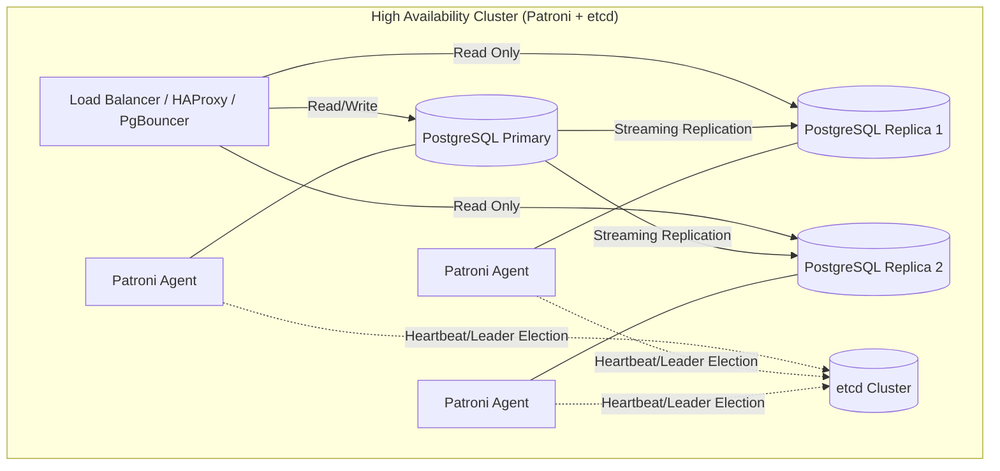

# RDBMS: PostgreSQL, MySQL, MariaDB

## 📖 DevOps-история: Боль и Решение

**Боль:** Проект быстро рос. Изначально выбрали MySQL для простоты, но со временем сложные аналитические запросы начали "класть" базу. Разработчики писали SQL с огромным количеством `JOIN` и оконными функциями, которые в MySQL тех версий работали неоптимально. Появились проблемы с блокировками, а миграции схем таблиц лочили таблицы на часы, останавливая работу сервиса (DDL locks).

**Решение:** Анализ профиля нагрузки привел к разделению (CQRS/Read Replicas). Часть транзакционных сервисов перевели на PostgreSQL, который лучше справляется со сложными запросами, имеет мощную систему типов (JSONB, GIS) и поддерживает конкурентное создание индексов (`CONCURRENTLY`). Для минимизации даунтайма при миграциях начали использовать инструменты типа `gh-ost` для MySQL и строгие правила для PostgreSQL (добавление столбцов без дефолтных значений и т.д.).

---

## 🏗 Сравнение и Архитектура (PostgreSQL HA)



---

## 🛠 Примеры конфигураций

**1. Настройка пулера соединений PgBouncer (pgbouncer.ini):**

```ini
[databases]
# Алиас базы -> реальная БД
my_app_db = host=127.0.0.1 port=5432 dbname=production

[pgbouncer]
listen_port = 6432
listen_addr = *
auth_type = md5
auth_file = /etc/pgbouncer/userlist.txt
# Transaction pooling - оптимально для микросервисов
pool_mode = transaction
max_client_conn = 1000
default_pool_size = 50
```

**2. Базовый тюнинг PostgreSQL (postgresql.conf) для 16GB RAM:**

```ini
# Memory Configuration
shared_buffers = 4GB           # ~25% of RAM
effective_cache_size = 12GB    # ~75% of RAM
work_mem = 64MB                # Memory for sorts/hashes per operation
maintenance_work_mem = 1GB     # Memory for VACUUM, CREATE INDEX

# Checkpoints & WAL
wal_level = replica
max_wal_size = 4GB
checkpoint_timeout = 15min
checkpoint_completion_target = 0.9
```

**3. Docker Compose для локальной разработки (MySQL 8):**

```yaml
version: '3.8'
services:
  mysql:
    image: mysql:8.0
    environment:
      MYSQL_ROOT_PASSWORD: rootpassword
      MYSQL_DATABASE: myapp
      MYSQL_USER: appuser
      MYSQL_PASSWORD: apppassword
    ports:
      - "3306:3306"
    volumes:
      - mysql_data:/var/lib/mysql
      # Инициализация схемы
      - ./init.sql:/docker-entrypoint-initdb.d/init.sql
volumes:
  mysql_data:
```

---

## 🌅 Day 2 Operations (Советы по эксплуатации)

- **Мониторинг:** Используйте инструменты вроде `pg_stat_statements` для Postgres, чтобы находить самые медленные и частые запросы. Обязательно мониторьте размер `WAL`/`Binlog` и лаг репликации.
- **Connection Pooling:** Никогда не подключайте сотни подов микросервисов напрямую к PostgreSQL. Используйте `PgBouncer` или `Odyssey`. Каждый коннект в PG — это тяжелый процесс (процессная модель, а не потоковая).
- **VACUUM и Bloat (PostgreSQL):** Следите за разрастанием таблиц (bloat). Настройте Autovacuum агрессивнее для часто обновляемых таблиц (`autovacuum_vacuum_scale_factor`).
- **Обновления:** Минорные версии накатывайте регулярно (исправления безопасности/багов). Для мажорных апгрейдов Postgres (например, 14 -> 15) используйте логическую репликацию для near-zero downtime миграции.

---

## 🚫 Антипаттерны

1. **Использование RDBMS для очередей:** Реализация очередей задач (message broker) на таблицах SQL с постоянным поллингом (`SELECT ... FOR UPDATE`). Это убивает I/O и приводит к deadlocks. Используйте RabbitMQ/Kafka.
2. **Слишком много индексов:** Создание индексов "на всякий случай". Индексы ускоряют чтение, но замедляют любую запись (`INSERT`/`UPDATE`/`DELETE`) и занимают место на диске.
3. **Хранение больших бинарных данных:** Запись картинок или видео (BLOB/Bytea) напрямую в базу. Лучше хранить их в S3, а в БД держать только ссылки (URL).
4. **Отсутствие таймаутов:** Приложения, которые делают запросы без `statement_timeout`. Один зависший тяжелый запрос может исчерпать пул соединений и положить весь кластер.
