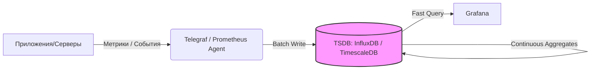

# Time-Series Databases (InfluxDB, TimescaleDB)

## DevOps История: Боль и Решение

**Боль:** Ваше приложение или инфраструктура генерирует тысячи метрик в секунду. Вы складываете их в классическую реляционную БД (PostgreSQL/MySQL). Поначалу всё хорошо, но через месяц таблица `metrics` разрастается до сотен гигабайт. Запросы `GROUP BY time(1m)` для дашбордов Grafana начинают выполняться минутами, диск "кипит" от постоянной записи, а удаление старых данных (`DELETE FROM ... WHERE time < ...`) блокирует таблицу и кладет базу.

**Решение:** Time-Series Database (TSDB). Это специализированные БД, оптимизированные для вставки огромных потоков данных, привязанных ко времени, сжатия этих данных и быстрого выполнения агрегирующих запросов по временным окнам.

## Архитектура



## Примеры

### 1. InfluxDB (v2) Docker Compose

```yaml
version: '3'
services:
  influxdb:
    image: influxdb:2.7
    ports:
      - "8086:8086"
    environment:
      - DOCKER_INFLUXDB_INIT_MODE=setup
      - DOCKER_INFLUXDB_INIT_USERNAME=admin
      - DOCKER_INFLUXDB_INIT_PASSWORD=adminpassword
      - DOCKER_INFLUXDB_INIT_ORG=myorg
      - DOCKER_INFLUXDB_INIT_BUCKET=metrics
      - DOCKER_INFLUXDB_INIT_ADMIN_TOKEN=my-super-secret-auth-token
    volumes:
      - influxdb2_data:/var/lib/influxdb2

volumes:
  influxdb2_data:
```

### 2. TimescaleDB (PostgreSQL extension): Создание Hypertable

```sql
-- Обычная таблица
CREATE TABLE conditions (
    time        TIMESTAMPTZ       NOT NULL,
    location    TEXT              NOT NULL,
    temperature DOUBLE PRECISION  NULL,
    humidity    DOUBLE PRECISION  NULL
);

-- Превращение в гипертаблицу (парцитирование по времени)
SELECT create_hypertable('conditions', 'time');

-- Политика хранения (удаляем данные старше 6 месяцев)
SELECT add_retention_policy('conditions', INTERVAL '6 months');
```

## Day 2 Operations (Эксплуатация)

1. **Downsampling (Continuous Aggregates / Tasks):** Сырые данные нужны только за последние несколько дней. Дальше их нужно сжимать до 5-минутных или часовых интервалов. Обязательно настраивайте автоматические агрегации, чтобы дашборды за месяц грузились мгновенно.
2. **Retention Policies (Политики хранения):** Данные в TSDB должны удаляться автоматически (Drop Chunks). Никогда не используйте ручной `DELETE` — в TSDB это дорогостоящая операция. Настройте TTL на бакеты.
3. **Мониторинг Cardinality:** Следите за количеством уникальных серий (комбинаций тегов/лейблов). Высокая кардинальность — убийца любой TSDB (приводит к исчерпанию RAM).
4. **Compression (Сжатие):** Включайте нативное сжатие старых чанков (особенно актуально для TimescaleDB), это может сэкономить до 90% места на диске.

## Антипаттерны

- ❌ **High Cardinality (Высокая кардинальность):** Запись уникальных идентификаторов (UUID сессии, UserID, хэши коммитов) в качестве *тегов/индексов*. Теги должны быть конечными (например, `host=web01`, `region=eu-central`). Уникальные значения пишите как *поля (fields)*.
- ❌ **Обновление исторических данных:** TSDB оптимизированы под Append-Only (запись новых данных). Частые `UPDATE` старых записей убьют производительность.
- ❌ **Отношение к TSDB как к реляционной БД:** Попытки строить сложные `JOIN` между метриками и бизнес-сущностями (лучше обогащать данные метриками на этапе сбора).
