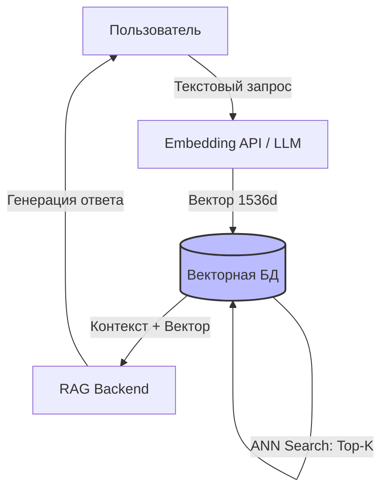

# Векторные Базы Данных (Milvus, Qdrant, pgvector)

## DevOps История: Боль и Решение

**Боль:** Ваша команда пилит фичу на базе AI (RAG - Retrieval-Augmented Generation) или семантический поиск. Нужно найти документы, похожие по смыслу на запрос пользователя. Вы генерируете вектор (embedding) из 1536 чисел для каждого документа и сохраняете их в реляционную БД. При поиске приходится вычислять косинусное расстояние между вектором запроса и *каждой* строкой в базе (Full Scan). База ложится при десятках запросов в секунду.

**Решение:** Векторная база данных. Она использует специальные алгоритмы приближенного поиска ближайших соседей (ANN - Approximate Nearest Neighbor, обычно графы HNSW). Вместо точного перебора всех записей, база мгновенно находит самые похожие векторы за миллисекунды, используя оперативную память.

## Архитектура (Типичный RAG flow)



## Примеры

### 1. pgvector (Расширение PostgreSQL)

Отличный выбор, если векторы тесно связаны с реляционными данными (метаданными).

```sql
-- Включаем расширение
CREATE EXTENSION vector;

-- Создаем таблицу с колонкой типа vector (размерность 1536 для OpenAI)
CREATE TABLE documents (
    id bigserial PRIMARY KEY,
    content text,
    embedding vector(1536)
);

-- Создаем HNSW индекс для быстрого поиска (косинусное расстояние)
CREATE INDEX ON documents USING hnsw (embedding vector_cosine_ops);

-- Поиск 5 самых похожих документов
SELECT id, content 
FROM documents 
ORDER BY embedding <=> '[0.1, 0.2, ...]' 
LIMIT 5;
```

### 2. Qdrant Docker Compose

Qdrant — быстрая векторная БД на Rust.

```yaml
version: '3.7'
services:
  qdrant:
    image: qdrant/qdrant:v1.8.2
    ports:
      - "6333:6333" # REST API
      - "6334:6334" # gRPC
    volumes:
      - qdrant_data:/qdrant/storage
    environment:
      - QDRANT__SERVICE__MAX_REQUEST_SIZE_MB=50

volumes:
  qdrant_data:
```

## Day 2 Operations (Эксплуатация)

1. **Memory Sizing (ОЗУ — царь):** ANN индексы (HNSW) должны полностью помещаться в оперативную память для обеспечения низкой задержки. Если индексы не влезают в RAM, производительность падает катастрофически (свап/IO диска). Всегда планируйте ОЗУ с запасом.
2. **Изоляция Tenant'ов:** Для SaaS продуктов используйте партиционирование (Collections / Partitions / Payload filters), чтобы поиск не бегал по векторам чужих клиентов.
3. **Re-indexing:** Построение HNSW графа — тяжелый CPU-bound процесс. При массовой заливке данных отключайте индексацию, заливайте батчами, а затем стройте индекс.
4. **Бэкапы и Snapshot'ы:** Векторные БД поддерживают снэпшоты. Важно бэкапить не только векторы, но и полезную нагрузку (payload/metadata), иначе восстановленные векторы будут бесполезны.

## Антипаттерны

- ❌ **Хранение огромных метаданных (Blob/Text) прямо в векторной БД:** Векторные БД плохи как Key-Value хранилища для больших текстов. Лучше хранить в векторной БД только ID, Вектор и фильтруемые метаданные (теги), а сам тяжелый контент документа доставать из Postgres/S3 по ID.
- ❌ **Частые обновления (UPDATE) векторов:** Векторные индексы не любят мутации. Частое обновление приводит к фрагментации HNSW графа. Лучше применять стратегии Tombstone (удаление) и вставку новых векторов батчами.
- ❌ **Поиск без пред-фильтрации (Pre-filtering):** Искать по всем векторам, а затем фильтровать результаты по `user_id`. Правильно — передавать `user_id` прямо в векторный поиск, чтобы БД искала соседей только среди разрешенных граней графа (Filtered ANN).
