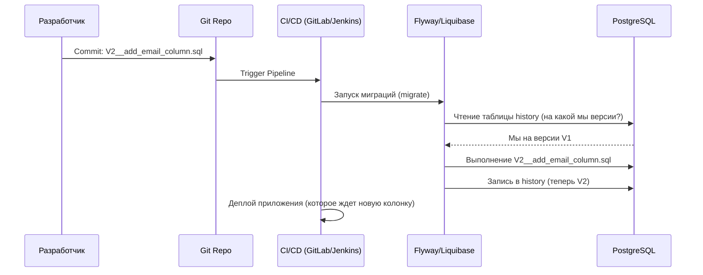

# Миграции БД (Liquibase, Flyway)

## 📖 История боли и решения

**Боль:** Команда разрабатывала новую фичу и добавила колонку в таблицу. В dev-окружении скрипт `ALTER TABLE` накатили руками администраторы. При деплое в production скрипт забыли. Сервис упал с ошибкой `column does not exist`. Дамп БД и ручное сравнение схем занимали часы. 

**Решение:** Версионирование базы данных как кода (Database as Code). Внедрен инструмент миграций (Flyway или Liquibase). Теперь все изменения схемы БД лежат в репозитории рядом с кодом, имеют строгий порядок (V1, V2, V3...) и накатываются автоматически в CI/CD пайплайне до или во время деплоя приложения.

## 🏗 Архитектура



## 🛠 Примеры

### Flyway (SQL)

**Файл миграции `V1.1__Create_users_table.sql`:**
```sql
CREATE TABLE users (
    id SERIAL PRIMARY KEY,
    username VARCHAR(50) NOT NULL,
    created_at TIMESTAMP DEFAULT CURRENT_TIMESTAMP
);
```

**Запуск через Docker (CI/CD):**
```bash
docker run --rm -v $(pwd)/sql:/flyway/sql \
  flyway/flyway:9 \
  -url=jdbc:postgresql://db:5432/mydb \
  -user=myuser -password=mypassword \
  migrate
```

### Liquibase (YAML/XML)

**Файл `changelog-1.0.yaml`:**
```yaml
databaseChangeLog:
  - changeSet:
      id: 1
      author: dev-team
      changes:
        - createTable:
            tableName: orders
            columns:
              - column:
                  name: id
                  type: int
                  constraints:
                    primaryKey: true
```

## 🚀 Day 2 Operations

*   **Backward Compatibility (Обратная совместимость):** Миграции всегда должны быть обратно совместимыми! Если вы удаляете колонку, сначала перестаньте ее читать в коде (деплой 1), затем перестаньте в нее писать (деплой 2), и только в следующем релизе делайте `DROP COLUMN` (деплой 3). Иначе при Zero-Downtime деплое старые поды упадут.
*   **Идемпотентность и `IF EXISTS`:** По возможности пишите `CREATE TABLE IF NOT EXISTS`. Это спасет, если миграция упадет посередине (особенно актуально для БД без транзакционного DDL, таких как MySQL).
*   **Изоляция выполнения:** Запускайте миграции как отдельный Job (например, Kubernetes Job или initContainer), а не при старте самого приложения, если у вас много реплик. Если 10 подов одновременно попытаются накатить миграции, могут возникнуть дедлоки или конфликты, несмотря на блокировки в history-таблицах.

## ⛔ Антипаттерны

1.  **Изменение уже накаченных скриптов:** Никогда не меняйте файл, который уже отработал на production (например, `V1.sql`). Если ошиблись — создайте новый скрипт `V2.sql`, который исправляет ошибку из V1. Утилита миграций вычисляет чексуммы файлов и упадет, если старый файл изменится.
2.  **Долгие блокировки DDL:** Выполнение `CREATE INDEX` (без `CONCURRENTLY` в Postgres) или `ALTER TABLE` с дефолтным значением на таблице в 100 млн строк заблокирует таблицу на часы. Production будет лежать. Всегда тестируйте миграции на клоне production-данных.
3.  **Смешивание DDL (схемы) и DML (данных):** Старайтесь разделять миграции, меняющие структуру (DDL), и скрипты, массово обновляющие данные (DML). Массовые `UPDATE` лучше делать отдельными background-джобами батчами, чтобы не перегрузить транзакционный лог.
