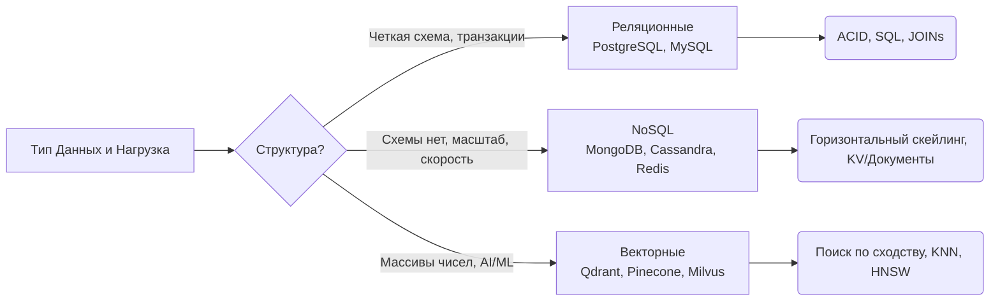

# Реляционные vs NoSQL vs Векторные БД

## DevOps-история (Боль и Решение)
**Боль:** Стартап начинал с PostgreSQL для всего: пользователи, логи, сессии и, недавно, векторы для ИИ-фичи. Таблица логов разрослась до терабайта, поиск по эмбеддингам стал занимать долгие секунды, а база начала падать от нагрузки по памяти (OOM).
**Решение:** Внедрение подхода Polyglot Persistence (разделение по паттернам доступа). PostgreSQL оставлен только для транзакционных данных (биллинг, профили). Логи и сессии переехали в NoSQL (DynamoDB/Redis), а эмбеддинги — в специализированную векторную БД (Qdrant), что вернуло отклик к миллисекундам и снизило общие затраты на инфраструктуру.

## Сравнение и Применение



## Примеры (Конфиги и Код)

**Реляционная БД (PostgreSQL - docker-compose.yml):**
```yaml
services:
  postgres:
    image: postgres:15
    environment:
      POSTGRES_DB: app_db
      POSTGRES_USER: app_user
      POSTGRES_PASSWORD: ${PG_PASS}
    volumes:
      - pg_data:/var/lib/postgresql/data
    deploy:
      resources:
        limits:
          memory: 2G
```

**NoSQL (Redis - Bash CLI пример):**
```bash
# Сохранение пользовательской сессии с TTL (Time To Live) на 1 час
redis-cli set user_session:8842 "session_data_here" EX 3600
```

**Векторная БД (Qdrant - Python snippet):**
```python
# Поиск похожих контекстов для RAG-приложения
client.search(
    collection_name="knowledge_base",
    query_vector=[0.25, 0.5, 0.75, 0.12, 0.9],
    limit=5 # Вернуть топ-5 похожих
)
```

## Day 2 Operations
- **Регулярные бекапы и тесты восстановления (DR):** Настройте WAL-архивирование (например, с помощью WAL-G/pgBackRest) для реляционных БД и обязательно проверяйте на практике, что бекапы можно восстановить за приемлемое RTO.
- **Мониторинг Connection Pools:** Используйте PgBouncer или RDS Proxy для PostgreSQL. Микросервисы могут быстро исчерпать лимит подключений к БД при пиковых нагрузках (connection exhaustion).
- **Обслуживание индексов:** В реляционных БД настраивайте авто-vacuum и удаляйте неиспользуемые индексы. В векторных БД следите за потреблением RAM графовыми индексами (HNSW).

## Антипаттерны
- **Silver Bullet Database:** Использовать реляционную БД как очередь сообщений (Message Broker) или хранилище временных рядов (Time-Series). Это приводит к постоянным блокировкам и быстрому распуханию таблиц (Bloat).
- **Отсутствие лимитов памяти:** Запускать БД в Kubernetes без строгих `resources.requests/limits` — гарантированный путь к тому, что OOM Killer прибьет процесс базы в самый неподходящий момент.
- **Изменение схемы (Migrations) без обратной совместимости:** Удаление колонки или переименование таблицы без подготовки кода (в несколько этапов). Это приводит к downtime при деплое новых версий приложения.
